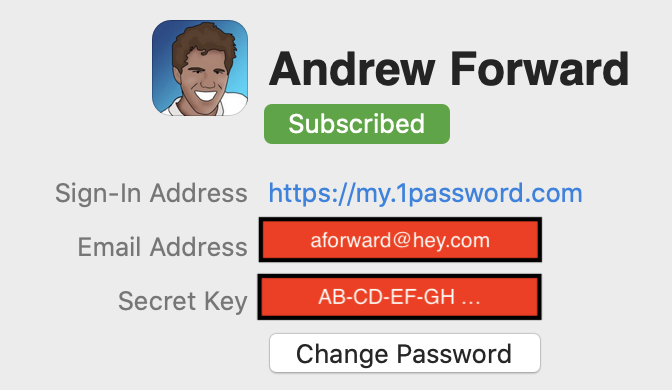
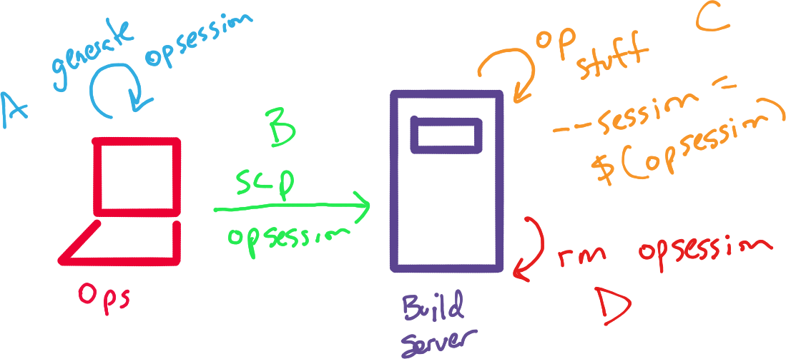

# Bootstrapping 1Password CLI using Expect
#meta tags[] 1password
#meta datetime 2020-08-27

## Summary

Did you know [1Password has a CLI tool](https://support.1password.com/command-line-getting-started/)? In this article we will write a [small script using expect](https://linux.die.net/man/1/expect) called `opsession` to better manage secrets in our automation pipeline.  Using `opsession` you can then use 1password `op` commands like

```bash
op get item db_password --session $(opsession)
```

Without having any user intervention.

## Article

Did you know [1Password has a CLI tool](https://support.1password.com/command-line-getting-started/)?  Password management and automation
do not like each much.  If I want automation then I cannot require
user input.  If I need a password then I should not store that in
my automation.

1Password CLI helps us track _all our passwords_, but there is still
a bootstrapping problem of _authenticating against 1Password itself_.

Let us explore a possible solution below.

### Installing 1Password CLI

First, we need to [download and installing 1Password](https://app-updates.agilebits.com/product_history/CLI).  We will want this running within our production setup as well as locally.

For me, that means getting things running on Mac OSX (Debian) and Ubuntu.  For the scripts below make sure to `cd` into where you want 1password installed).  I will be using `~/.bin/1password` on my Mac, and `/opt/1password` on Ubuntu.

#### Installing Go

The 1Password CLI runs on [golang](https://golang.org/) and you can find your
[download version here](https://golang.org/dl/).  It is also available via [Brew](https://brew.sh) with `brew install golang`.

Before proceeding, make sure `go` is installed correctly.

```bash
which go
```

#### Installing on a Mac OS X

For Mac, we run the following

```bash
ONEPASSWORD_VERSION=${ONEPASSWORD_VERSION-1.5.0}
wget https://cache.agilebits.com/dist/1P/op/pkg/v${ONEPASSWORD_VERSION}/op_darwin_amd64_v${ONEPASSWORD_VERSION}.pkg
sudo installer -pkg op_darwin_amd64_v${ONEPASSWORD_VERSION}.pkg -target /
```

If correctly installed the CLI tool and `op` is on your your `$PATH`, then you should see the right version of 1password installed.

```bash
op --version
```

#### Installing on Ubuntu (Linux)

On Linux (tested on Ubuntu 20.04), we run the following

```bash
ONEPASSWORD_VERSION=${ONEPASSWORD_VERSION-1.5.0}
wget https://cache.agilebits.com/dist/1P/op/pkg/v${ONEPASSWORD_VERSION}/op_linux_amd64_v${ONEPASSWORD_VERSION}.zip
unzip -u op_linux_amd64_v${ONEPASSWORD_VERSION}.zip
```

You should also verify the file you just downloaded using `gpg` as shown below

```bash
gpg --receive-keys 3FEF9748469ADBE15DA7CA80AC2D62742012EA22
gpg --verify op.sig op
```

If you get an error about when verifying the keys, consider changing your keyserver as shown below.

```bash
mkdir -p $HOME/.gnupg
echo "keyserver keyserver.ubuntu.com" >> $HOME/.gnupg/gpg.conf
```

As with Mac OSX, if correctly installed the CLI tool and `op` is on your your `$PATH`, then you should see the right version of 1password installed.

```bash
op --version
```

### Running 1Password CLI

Before we try to _automate_ password management with the CLI, first make sure you use the tool directly.  [Read the introduction from 1Password for way more details](https://support.1password.com/command-line-getting-started/)

Let's confirm you can sign-in, please use your own credentials :-)


```bash
op signin my aforward@hey.com
```

The output will prompt you for your `Secret Key` and your `Password`.

```bash
$ op signin my aforward@hey.com
Enter the Secret Key for aforward@hey.com at my.1password.com: AB-CDEFG-...
Enter the password for aforward@hey.com at my.1password.com:
```

You can find most of information in the `Preferences` of the 1Password GUI.



One password will then give you a 30-minute token

```bash
export OP_SESSION_my="abcdef123456"
# This command is meant to be used with your shell's eval function.
# Run 'eval $(op signin my)' to sign in to your 1Password account.
# Use the --raw flag to only output the session token.
```

Using that token, we can now make secure calls to our 1Password vault.  Here is an example of listing out our vaults.

```bash
op list vaults --session abcdef123456
```

If everything worked as expected your output should look similar to

```bash
[{"uuid":"xyz456","name":"Personal"}]
```

If something went wrong (e.g. you copy the fake token above), then you might get an error like.

```bash
[ERROR] 2020/08/27 16:26:09 Invalid session token
```

### Bootstrap 1Password Session with Expect

Once we have the session token, our automate scripts can work _person-free_ for 30-minutes (yipee), but it is still a bit arduous generate and will need documentation (like this article) to accompany your automation scripts.

Let's explore how we could automate session [generation using expect](https://linux.die.net/man/1/expect).  Let's create a script called `opsession` (and make it executable `chmod 700 opsession`).

```bash
#!/usr/bin/expect

set timeout 20

log_user 0
spawn op signin --raw my.1password.com aforward@hey.com
expect -re "Enter the Secret Key for aforward@hey.com at my.1password.com: " { send "AB-CDEFG-HIJKL\r" }
expect -re "Enter the password*" { send "n1c3try\r" }
expect {
    -re "\n(.*)\r\n" {set result $expect_out(1,string)}
}
expect *
log_user 1
puts $result
```

You will need to change the following

| Field | Description |
| --- | --- |
| `my` from `my.1password.com` | Your organization name with 1Password |
| `aforward@hey.com` | Your email |
| `AB-CD-EF` | Your `Secret Key` |
| `nicetry` | Your global 1password password |

If we run our script

```bash
./opsession
```

It should output a valid token like

```bash
abc123-def456-ahahaha
```

We can now use that script directly against an `op` opeation like

```bash
op list vaults --session $(./opsession)
```

Or, we could store the `OP_SESSION` and re-use it

```bash
OPSESSION=$(./opsession)
op list vaults --session $OPSESSION
op list users --session $OPSESSION
```

### Split opsession generation from op usage

The script above is not safe, as it contains the very 1password
that you were sworn to protect.

In the diagram below we show how we can isolate the safety
of `opsession` from its usage (and ultimate destruction).



In the above,

A. An administrator / keeper of keys can generate an opsession
locally.

B.  The admin can securely transfer `opsession` to the appropriate
build environment.

C. All your build scripts can now securetly interact with `op` without
ever having to ask a real person for a secret.

D. When the build script is done, you can delete your `opsession`
completely removing any trace of those very secret secrets.

A major benefit to the above is that once `opsession` is seeded into
your (**secure**) build environment then you can completely automate
all your secret needs.

### Warning, Warning, Protect that opsession

After some conversations with a colleague Tom, he raised concerns
about possibly being careless with the `opsession` file and accidentially
exposing to our 1password account.

Indeed, we are trading increased levels of automation with increased
security exposure as our `opsession` does contain all the necessary ingredients to
access your 1password account.  For small teams (or solo-preneurs) that's fine,
but within an organization the exposure from carelessness is not worth it.

To avoid sharing that information directly you can instead just
share the 30-minute token as [discussed here](/articles/1password-sessions).
By just sharing the token, your build server is now

### Code Generator for opsession

Let's take our automation one step further, and securely genreate
that opsession file for you.

We use `read -p` to collect information from `admin` user
about their 1password setup, and can even mask the password using `read -s -p`.
We make this file only access to the current user with `chmod 700 opsession`.

```bash
#!/bin/bash

read -p "Enter the Account: " ACCOUNT
read -p "Enter the Email: " EMAIL
read -p "Enter the Secret Key: " SECRET_KEY
read -s -p "Enter your Password: " PASSWORD
echo ""

printf "%b" "#!/usr/bin/expect

set timeout 20
log_user 0
spawn op signin --raw ${ACCOUNT}.1password.com ${EMAIL}
expect -re \"Enter the Secret Key for ${EMAIL} at ${ACCOUNT}.1password.com: \" { send \"${SECRET_KEY}\\\\r\" }
expect -re \"Enter the password*\" { send \"${PASSWORD}\\\\r\" }
expect {
    -re \"\\\\n(.*)\\\\r\\\\n\" {set result \$expect_out(1,string)}
}
expect *
log_user 1
puts \$result" > opsession

chmod 700 opsession
```

And here we are, a few additional scripts later but we now have a _relatively_ straight forward way to automate our scripts but also have some great **security** around not sharing passwords within those scripts (or repositories).

