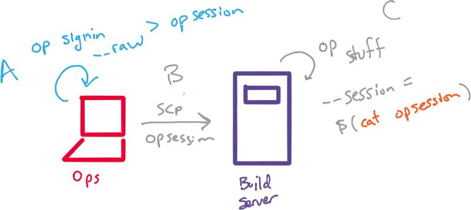

# Automating 1Password CLI with --session
#meta tags[] 1password
#meta datetime 2020-08-28

## Summary

In a [our previous post](/articles/1password-bootstrap), we looked
at generating a 1password session without requiring user input.
Today we will look at generating a _one-time_ (30-minute) token
on your local machine and only sharing that with your build servers.

```bash
op get item db_password --session $(cat opsession)
```

## Article

In a [our previous post](/articles/1password-bootstrap), we looked
at generating a 1password session without requiring user input.
Today we will look at generating a _one-time_ (30-minute) token
on your local machine and only sharing that with your build servers.

If you do not have 1password CLI setup, then please [read our previous post](/articles/1password-bootstrap) on getting started, but as soon as it talks
about [generating sessions using expect](https://linux.die.net/man/1/expect)
then head back over here.

### Generation 1Password token using --raw

As we [saw previously](/articles/1password-bootstrap), we can `op` you can generate a session token.  Below we have two small changes.

```bash
op signin --raw my aforward@hey.com > opsession
```

* We added the `--raw` flag so that we only output the 1password token

* We redirect the output to a `opsession` file.

Now instead of building a _forever_ re-useable `opsession` ([as we did with expect](/articles/1password-bootstrap)), we now have a 30-minute `opsession` token (within a file) that we can share with our build server as seen below (step B).



Our automation scripts can now use the `--session` flag pointing to the contents
of our token with `cat opsession`.  For example.

```bash
op get item db_password --session $(cat opsession)
```

In this approach, we are still generating 1password sessions locally, and then sharing the token on our _build_ servers.  Those environments now have 30-minutes _access_ to the secrets it needs (DB passwords, API secrets, etc) in a completely autonomous way.

Happy automation!