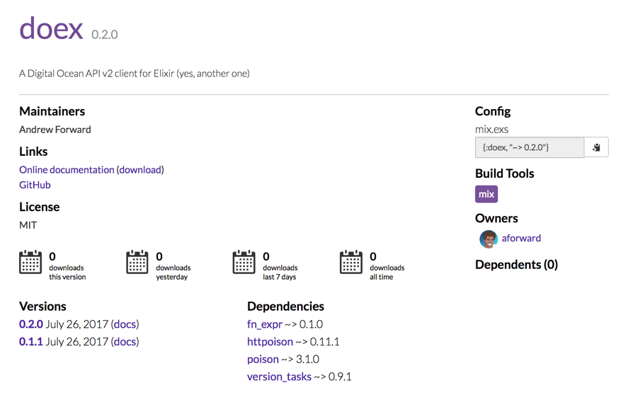
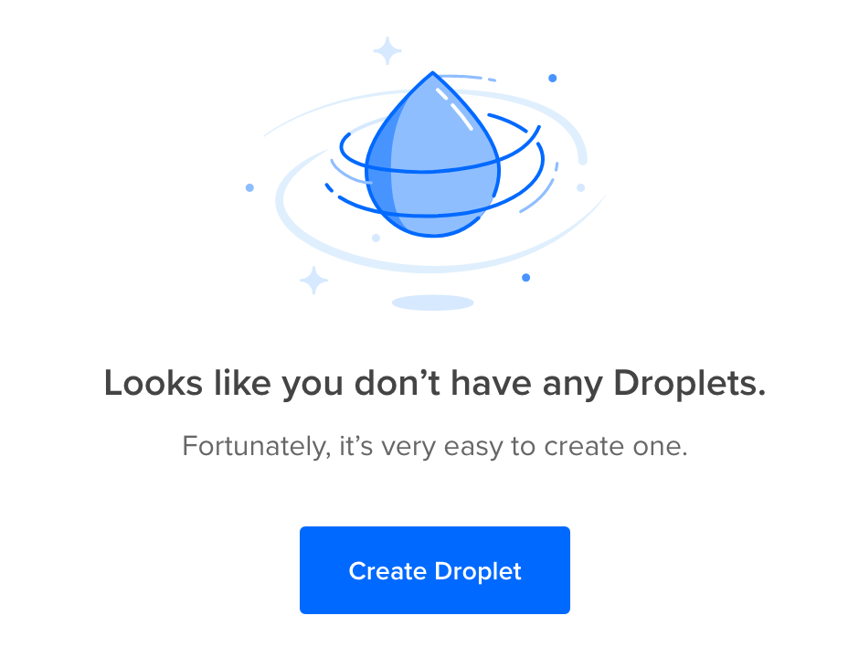
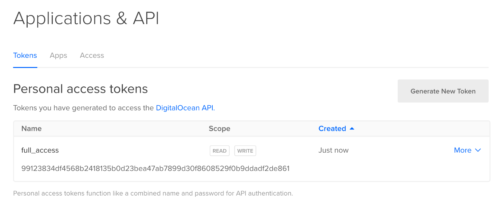
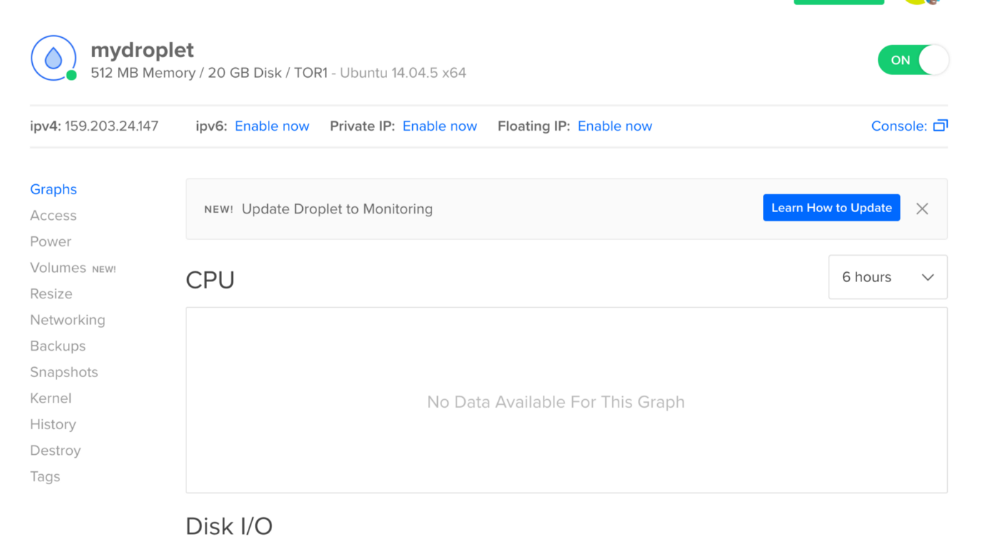
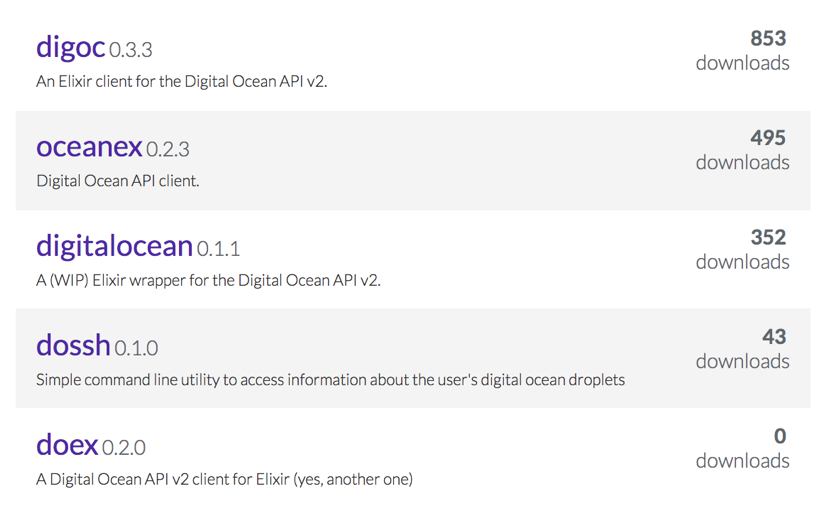

# Yet Another Digital Ocean API client in Elixir
#meta datetime 2017-07-28
#meta tags[] elixir digitalocean

## Summary

Want to automate your infrastructure leveraging the awesome [Digital Ocean API V2](https://developers.digitalocean.com/documentation/v2/), then the shell is your friend. Here we will learn about how to access the API from the command line using Elixir's [Escript](https://hexdocs.pm/mix/master/Mix.Tasks.Escript.Build.html) tooling.



## Article

Want to automate your infrastructure leveraging the awesome [Digital Ocean API V2](https://developers.digitalocean.com/documentation/v2/), then the shell is your friend. Here we will learn about how to access the API from the command line using Elixir's [Escript](https://hexdocs.pm/mix/master/Mix.Tasks.Escript.Build.html) tooling.


Doex, access [Digital Ocean](https://m.do.co/c/e450543d2a29)'s API through the shell and/or Elixir

First, if you don't know [Digital Ocean](https://m.do.co/c/e450543d2a29) (my referral link should you wish to sign up, we both get a little kickback) is a cloud provider that helps you spin up new servers, quickly, to help get your application into production.



With features like [Floating IPs](https://www.digitalocean.com/community/tutorials/how-to-use-floating-ips-on-digitalocean), [Load Balancers](https://www.digitalocean.com/community/tutorials/how-to-create-your-first-digitalocean-load-balancer), and [Firewalls](https://www.digitalocean.com/community/tutorials/an-introduction-to-digitalocean-cloud-firewalls) you can be up and running with a production grade setup on the cheap.

After setting up your DO account, you then need to generate a new Token through the API link from the top of your digital ocean dashboard.


## That's not a real token, so don't bother trying

Store that token safely, as it allows scripts to perform actions on your account without human intervention.

Now let's play with [doex](https://hex.pm/packages/doex), an elixir escript command line tool. This article assumes you have an [elixir environment up and running](https://elixir-lang.org/getting-started/introduction.html).

To install _doex_, run

```bash
mix escript.install github capbash/doex
```

You might see a warning like

```bash
warning: you must append "/Users/<username>/.mix/escripts" to your PATH if you want to invoke escripts by name
```

Heed the adashvice and add it to your path, for example (each system is slightly different, so don't blindly follow, instead learn more about PATH)

```bash
vi ~/.bash_profile
# add something like
PATH="$HOME/.mix/escripts:$PATH"
export PATH
```

If you are up and running, then you can get help by calling doex without any arugments.

```bash
doex
```

The output will show you what's available on the command line, at this time that includes

```bash
doex v0.3.1
doex is a API client for Digital Ocean's API v2.

Available tasks:

doex config           # Reads, updates or deletes Doex config
doex droplets.create  # Create a droplet on Digital Ocean
doex init             # Initialize your doex config

Further information can be found here:
  -- https://hex.pm/packages/doex
  -- https://github.com/capbash/doex
```

Let's [configure our server](https://hexdocs.pm/doex/Mix.Tasks.Doex.Config.html#content) to talk to our [Digital Ocean](https://m.do.co/c/e450543d2a29) account. I will use `ABC123DEF456` as my DO Token, please update the scripts below based on your token.

```bash
doex init && \
  doex config token ABC123DEF456
```

Next, let's [create a new droplet](https://hexdocs.pm/doex/Mix.Tasks.Doex.Droplets.Create.html#content).

```bash
mix doex.droplets.create mydroplet \
  --region tor1 \
  --tags myt \
  --image ubuntu-14-04-x64 \
  --size 512mb
```

It's just that easy.



The command line script is still evolving, but all GET/POST DigitalOcean endpoints are available from the [elixir doex library](https://github.com/capbash/doex).


### Alternatives

If you are looking for a feature-complete command line tool, then checkout DigitalOcean's [doctl](https://github.com/digitalocean/doctl) command line tool. It is written in Go, and provides an excellent _shell_ for interacting with the DO API.

```bash
doctl is a command line interface for the DigitalOcean API.

Usage:
  doctl [command]

Available Commands:
  account     account commands
  auth        auth commands
  completion  completion commands
  compute     compute commands
  version     show the current version

Flags:
  -t, --access-token string   API V2 Access Token
  -c, --config string         config file (default is $HOME/.config/doctl/config.yaml)
  -o, --output string         output format [text|json] (default "text")
      --trace                 trace api access
  -v, --verbose               verbose output

Use "doctl [command] --help" for more information about a command.
```

There are also a few other Elixir specific libraries, but none that have gained much traction and none provide both elixir API access AND command line access.



Yep, that's doex at the the bottom there with a ton of downloads; watch out!

Happy automation.