# LiveView Talk at Empex 2019
#meta datetime 2019-07-02
#meta tags[] elixir empex talks liveview

## Summary

My talk at [Empex 2019](https://empex.co) is Live(View).  Click on
[Read More](/articles/empex-2019-liveview) to get the links to
related articles and GitHub Repos.

## Article

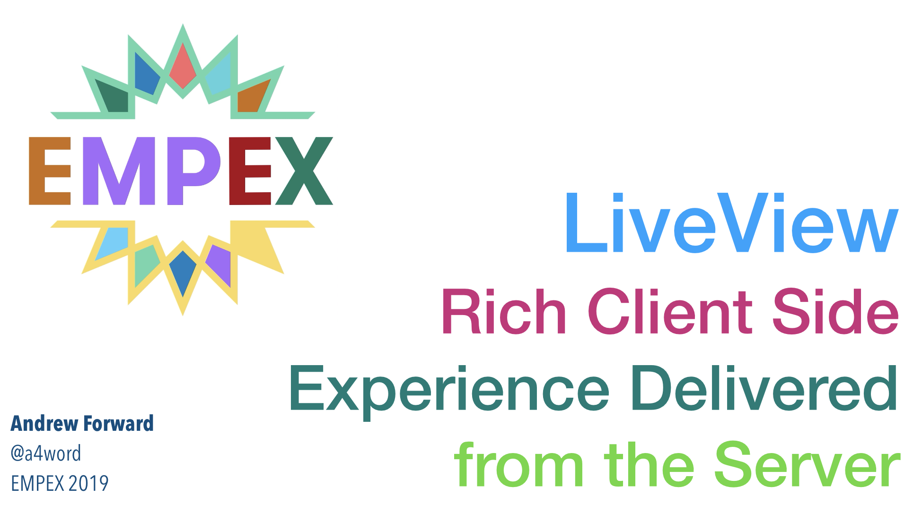

It was great to be back at [EMPEX](https://empex.co) in NYC again this (2019) year.
Absolutely lovely conference, and this year my talk on LiveView
was accepted.  Thank you to the organizing committee as my
talk was submitted only days after the library was made available
to the public and I hope I did not disappoint.

Here is the actual talk from May 2019

### Getting Started

Checkout the [curated List of LiveView Demos](/articles/liveview-examples)
as it includes links to articles on getting started and adding LiveView to your project.
If you are adventurous, you could install the `f/live_view_flag`
branch from from [my pull-request to add a -live flag](https://github.com/phoenixframework/phoenix/pull/3376).
This functionality is expected to be available in 1.5+

Within the talk, I mention of few projects directly.
The source code has been grouped within the [Code Samples on GitHub](https://github.com/empex2019liveview).

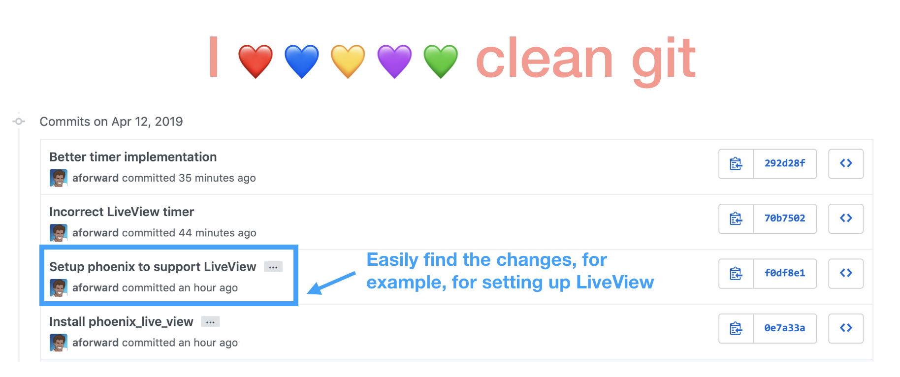

Look through the [git commit history](https://github.com/empex2019liveview/hangman/commits/main).
I like to [treat git history like an edited movie](https://www.youtube.com/watch?v=qpdYRPL3SVE) as opposed
to an instagram live feed, and telling a scripted story for posterity I find more useful versus capturing
the raw reality of potential many missteps.

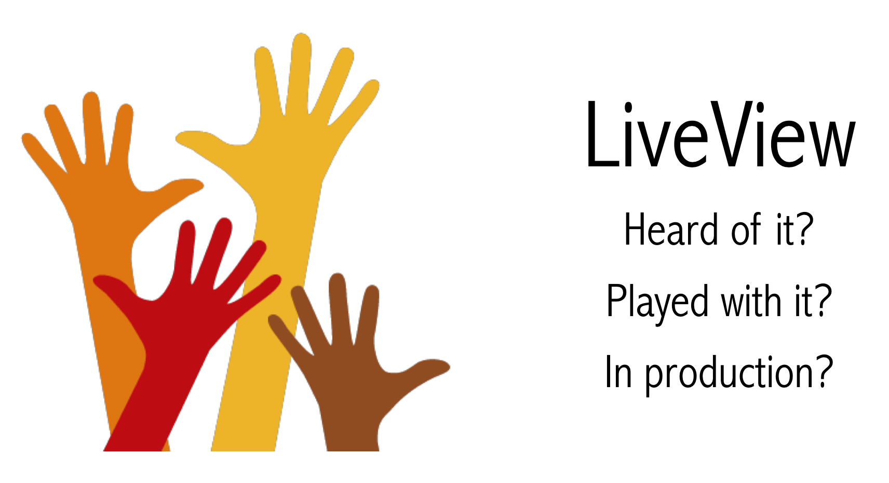

### Optimizing Dividend Reinvestment - The APP

I love dividends, and we worked through two examples of migrating [a dividend optimization app](https://dividends.io) away from JavaScript and JQuery to LiveView.

Bob owns 100 shares, so he would be paid about $68 a quarter.  Alice has double that, with 200 shares netting
her $136 every three months.

What are Bob and Alice going to do with all the income?
Obviously buy more shares.

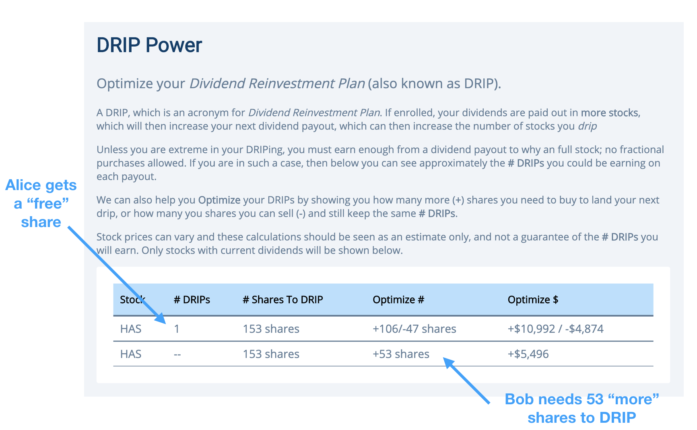

Let's build a application to help Alice and Bob optimize their DRIPs.

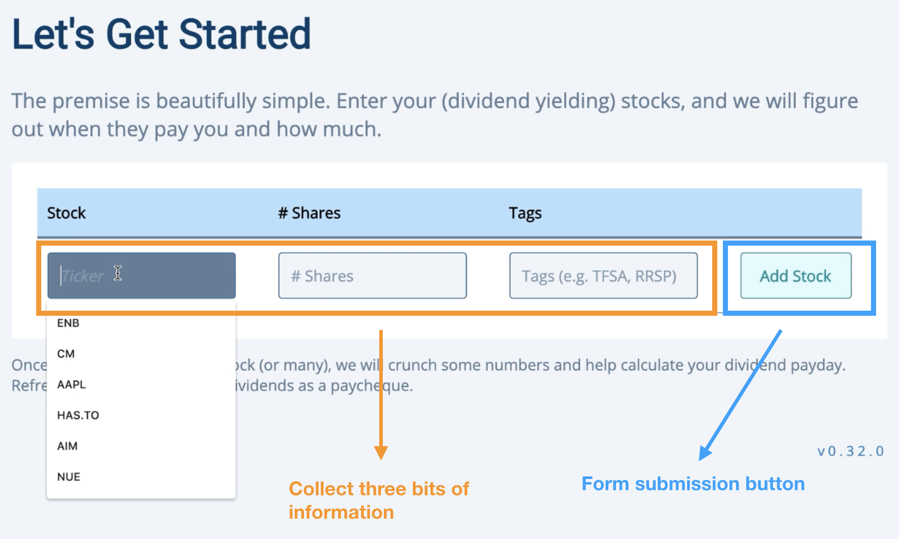

### Client Side Versus Server Side Rendering

A (somewhat esoteric) server side only rendition would look like

We definitely get the simplicity of having the rendering all in one spot.  But the page now needs to store local state to ensure the _paint_ the right display each time.

A client-side version support much improved rich client interactions would look like

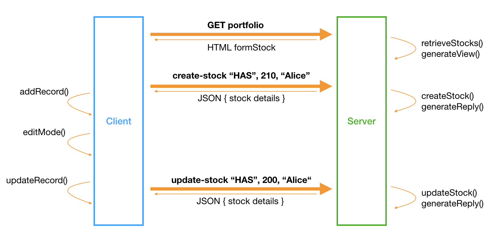

With a client side interaction, some (or all) of the rendering is moved to the browser, state is _somewhat_ shared between between client and server code.  But some interactions now no longer require any communication back to the server.

If we were using jQuery then the client would register the need for the event, and initiate the API call, aggregate the necessary data.

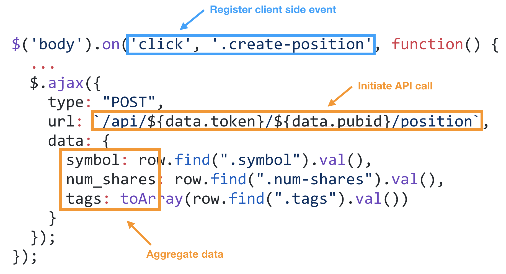

We would have some sort API endpoint on the server and decide on the data handshake, where the server has to agree to how the client will call it and the agree needs to agree to how the server will reply.

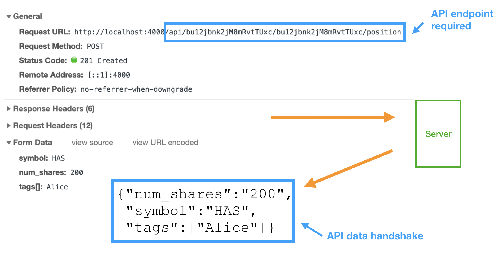

Our client then updates the display.  Here's we have plain old HTML templates with javascript, but we could easily be using a templating engine like Mustache or Handlebars, and/or a full on state mangement framework like React, Vue or Angular.

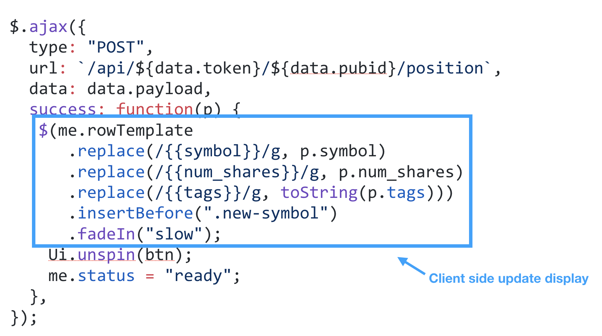

### Ceremony Versus Substance

Lets not confuse ceremony for substance.  There is a lot of boilerplate involved with setting up rich client-side interactions.  We have API calls registered on the client, and supported on the server.  We need our server to support those API endpoints, a decided upon message format to exchange information, our client needs to register events and make those API calls and finally the client needs to react to changes and update the display.

#### Managing Portfolio Ceremony Versus Substance

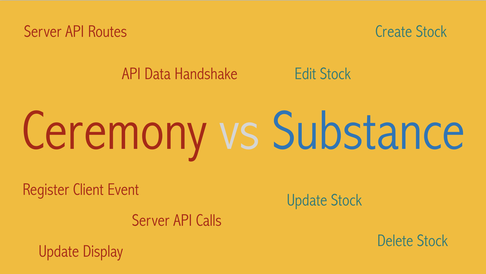

Contrast that with the substance of what we are trying to do… ultimately we are trying to do CRUD operations on our stock positions.  How much ceremony is dependent on the framework you are using, but the substance is usually constant regardless of picking Vue over React over jQuery.

#### Login Ceremony Versus Substance

Our dividending application will support _email_ based authentication, and is implemented with a multi-step form.

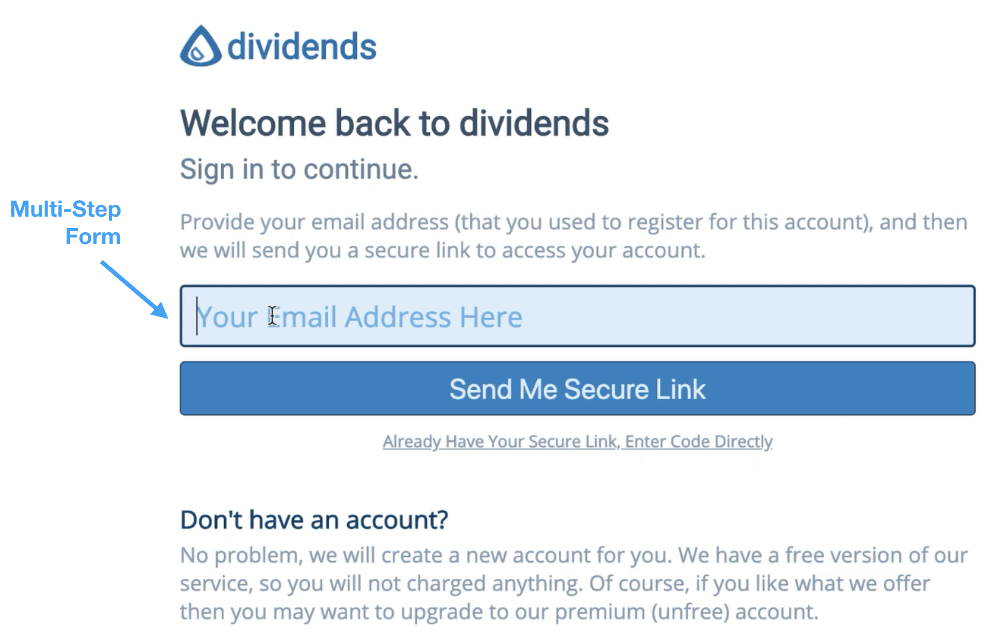

Some find this annoying, but we can't please everyone all the time.  Our application, like others that are rarely used, can benefit from pushing authentication in the users email so they don't have to remember another password.

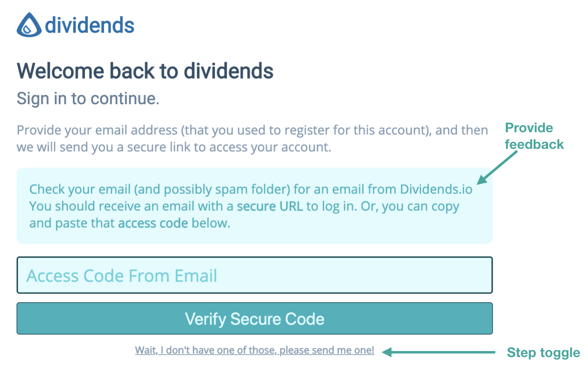

Ultimately we are trying to authenticate a user, which for our rarely used service is all about generating a secure token, sending it via email, and later validating it.

### An easier way?

I usually tend to start with jQuery (mostly for the AJAX library and convenient DOM selectors) and then as bugs arrive due to a mismatch between how the client and server handle state (and rendering), then I consider reaching for more sophisticated tools.

But, I am really just building a glorified spreadsheet, so I should not have to reach for tools needed to build Facebook or Spotify so early in the process (if ever)

It really should not be this hard.

### Enter Live View

And tada, it isn't.

<iframe src="/demo/empex" style="border: 0px" width="100%" height="800px"></iframe>

Check out the [source code our EMPEX logo demo](https://github.com/empex2019liveview/empexlogo).

[LiveView](https://github.com/phoenixframework/phoenix_live_view) is a library that integrates with Phoenix.  You are going to get rich client-side behaviour using event hooks in the client rendered code (aka html), but all event handlers live on server.  The client-side framework does the rest and you have very little ceremony, and practically no javascript.

<iframe src="/demo/hangman" style="border: 0px" width="100%" height="800px"></iframe>

Check out the [source code for our Hangman game](https://github.com/empex2019liveview/hangman).

So it's obviously not _no_ javascript, there is LiveView JavaScript that will be run on the client.  We are using Phoenix Channels and WebSockets which also involves JavaScript.  And, finally there are custom HTML phx- tags that are required to pull things together.

Let's look at the major moving parts of LiveView

### LiveView Client/Server Communication

For our login behaviour.

We have the following interactions between the client and the server

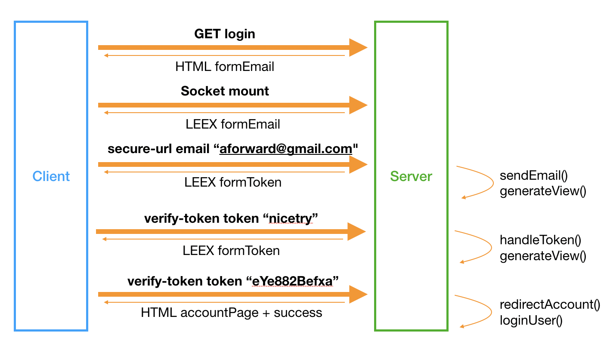

LiveView is still very much page focussed, so we first grab the page normally.  We return the HTML as we normally would.  Nothing special to see here.

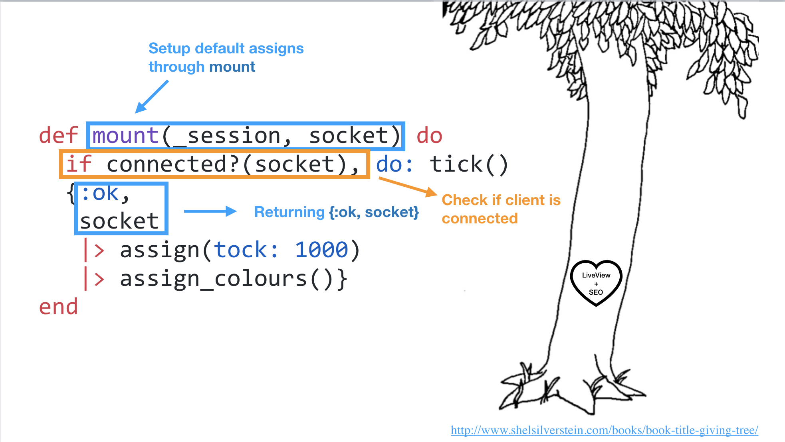

But, as we have tagged this view as a LiveView EEX, we now get a socket connection from the client back to our server.  This allows for the client to push events to the server, but also for the server to push updates back to the client without the need for client hook.  This mounted connection typically results in a no-operation on the client, but there will be duplicate calls on the server when things are being setup for the first time.

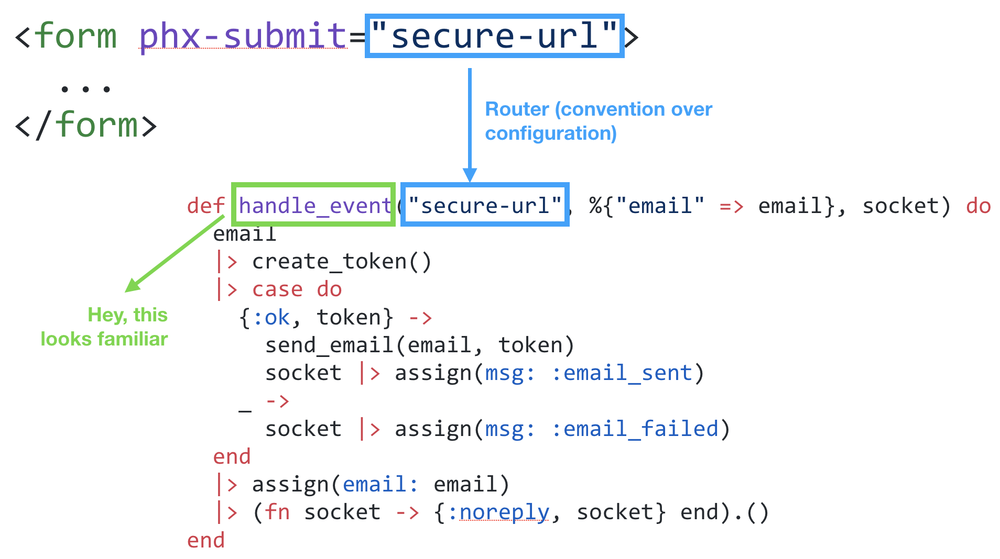

Events are sent back to the server through the mounted socket, and our LivewView page is really a GenServer that reacts to events and it returns an optimized encoding of your LEEX template.

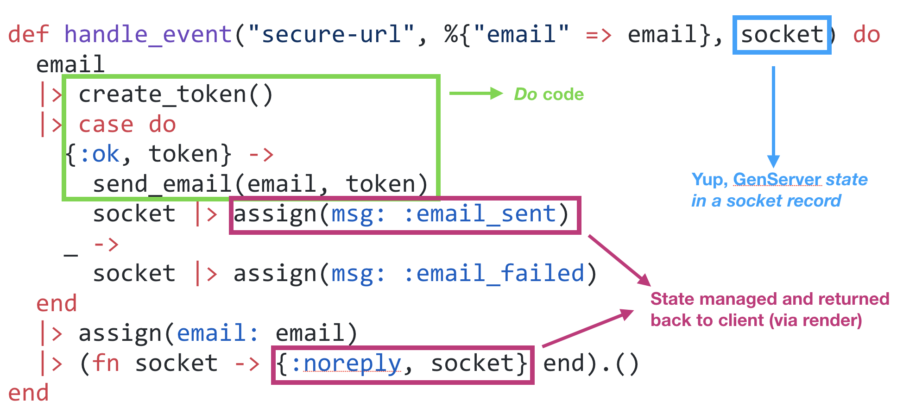

And much like a react-ive framework, your view is a reflection of the state of the page,
so it is simply re-rendered based on the new data.

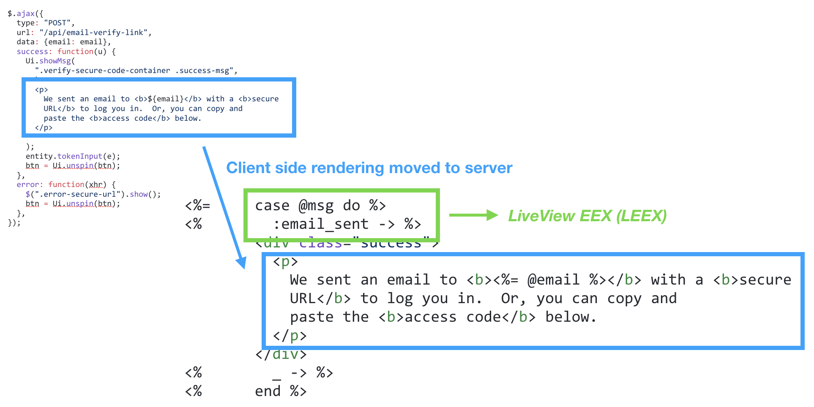

And that's about it.  The actual talk dived into a few other aspects
of Live View, some of which have be written up separately and linked below.

* [LiveView Examples And Other Articles](/articles/liveview-examples)
* [Passing Session Data From Socket To Session](/articles/from-sockets-to-sessions-with-liveview)
* [Custom JS with LiveView](/articles/executing-custom-javascript-with-liveview)
* Refactoring client side JavaScript into LiveView (unwritten, but in the talk)
* Usability / User Experience recipes using LiveView (also unwritten)
* Pitfalls to avoid when using LiveView's (I know, lots to write)
