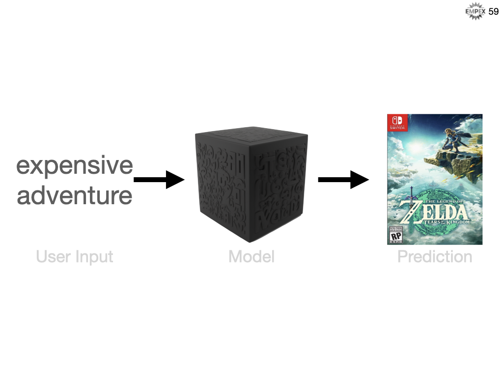

# Recommending Elixir for Machine Learning
#meta datetime 2023-06-08
#meta tags[] elixir empex talks ml nx scholar

## Summary

My talk at [Empex 2023](https://empex.co) about Elixir and
Machine Learning (specifically about building a recommendation
engine using Nx and Scholar).  Click on
[Read More](/articles/empex-2023-machine-learning) to get the links to
related articles and GitHub Repos.

## Article

Another wonderful [Empex NYC 2023](https://empex.co) conference,
so grateful that I got give some my experience as a newbie to
machine learning to the elixir community.

The code for this talk is available at [in github under aforward-oss/empex_recommend](https://github.com/aforward-oss/empex_recommend),
there you will find 2 elixir/phoenix applications and a bunch of Livebook notebooks.

When I started my journey working with Elixir ML I was new to the ML space, having zero experience in
Python libraries and only briefly glazed over TensorFlow.  As I knew Elixir, I thought I could dive
head first into code, but that lacking foundation was a huge blocker.

My talk therefore will include an introduction to integrating Elixir ML into your application,
and will spend some time looking at a few fundamentals and relating them traditional software development vocabulary.

Our first system will ease into ML using Linear Regression.  The second system will jump into our
recommender systems building a classification model which can work great to bootstrap your ML
recommender system and is known as a cold-start.

### Bringing Machine Learning To GiftBetter

Enter [Gift Better](https://giftbetter.co), an Ottawa-based start-up that offers a white-glove service so teams have access
to highly customized gifts.

They have several years worth of data on gift giving in a very personalized manner and
I am helping the team to scale their business through automation and insights into their data.
For GiftBetter, a gift is highly curated set of items such as a fancy locally sourced coffee,
a French press and a branded mug all offered, for example, by a sustainability focused business.
These gifts are purpose built for their clients and given as part of employee onboarding,
employee retention, client appreciation, or even conference gift bags.

Part of our path to scaling GiftBetter is making better inferences about their data and this ranges
from curating gifts (so internal tooling) and scaling the business with more self-serve tools
to help lower the barrier of entry into this gifting marketplace.

GiftBetter is a great case study in using no-code solutions to build a thriving business
I am helping to move much of their semi-structured data from their existing no-code sources
such as googlesheets, google docs, retail partner data,  customer relationship software,
e-commerce platform and accounting software into a gift-database that works within their
current processes.  This data fits nicely into a boring elixir application running phoenix
(and liveview) backed by Postgres database and currently deployed via [fly.io](https://fly.io).

### Why Elixir?

This talk was presented at an Elixir conference, so maybe it doesn't seem absurd to be
building a machine learning system NOT in python.  As python is mostly a foregone conclusion as
THE machine learning language.  But still I hope the question is asked: So why did we build this
platform on Elixir?

Let's answer that question on a few front fronts.

1. Yes what I have described so far seems to align nicely with a recommender system based on machine learning.  But some of the hardest and most time consuming aspects of machine learning is extracting the data and labelling well enough to get great results.  Elixir through Ecto and Phoenix and LiveView provide excellent tools for managing data, accessing APIs and giving the GiftBetter team a web front-end to visualize their data, clean and manage their data and better interact with their clients.  All of which accounts for 50% or more of the effort in a machine learning project.

2. The great gifting rules are not yet that complicated and even ML books give the advice that "it's OK not to start with machine learning".  And infact the original intention was to code the recommender by hand (without ML algorithms) and then as we incorporated more data from more of those semi-structured sources we would explore ML and use our rules engine to help label our data and train our system to eventually incorporate ML into the product.

3. In comes Elixir into the ML scene about 2 years with Nx and Axon. Staying within the same development ecosystem offers huge simplicity benefits, so I knew when we were ready to tackle ML we had somewhere to start.  But jumping right into Deep Learning and Neural Networks was a bit overwhelming so not on the radar as our first foray into this space.  But along comes Scholar!!!  Discovering scholar only days before the Empex call for talks, I decided to push ahead our schedule for ML integration and see if we could use the tooling to make some progress on our recommender system.

Here is a look at the current state (June 2023) of Elixir ML versus Python.

Scholar is a more traditional ML library and IMO more approachable as first foray into this space.
This talk did not go into any detail about neural networks or deep learning, but as we see above Elixir
does provide great tooling in this space and integrates with many external resources like huggingface
for pre-trained models, scidata for accessing existing datasets, axon for neural networks and
integration with onnx and visualization hooks into VegaLite.

### The Tensor

Below we see a scalar (0D array), a vector (1D array), a matrix (2D array), etc.
But, there's also a term in Math (and used heavily in ML libraries) called a ... Tensor.
A tensor is a data structure that can contain any numerical array and it is optimized
for performing mathematical operations on those structures.  This is the foundational
unit for building our machine learning algorithms.

Let's create some in [Elixir Nx using Livebook](https://github.com/aforward-oss/empex_recommend/notebooks).

### What is ML?

At the core, machine learning enables machines to learn automatically from data.
Use past experience to improve performance and make predictions without being explicitly coded.

Now, you might think, well I use data to make decisions in my traditional software development role,
so how is that different from machine learning.   In traditional programming you concretely know how to get to an answer, and in machine learning you concretely know what the answer should be.

Here is a common visualization to help distinguish ML and SD.

In the traditional world you know how the system should behave, the rules, and you apply those rules against the data to arrive at your desired answer.  Conversely, in an ML development world you know what you want, the answers, and you have the data that led you to those answers but you don't know the rules.  Or maybe more importantly, it is too difficult to fully qualify exactly what the rules are, and SD requires very explicit rules.

Let's build on that visualization.  I have renamed "data" to "input" and "answers" to output.
For our traditional system, perhaps we are a pizzeria and we always want to prepare 10 pizzas
 doughs plus 2-times as many reservations that we have for that evening.

Conversely, if we were to approach this problem with a machine learning solution,
then we start with a database of past reservations and this would be input data.
And we know how many pizza doughs were consumed on that evening, those are our answers.
We can then provide this information to our ML algorithm and train it against our data and
have it figure out what the rules should be.  In traditional SD, we precisely (but not necessarily
accurately) answer as 2-times-#-reservations, but here we infer or predict an answer
from the rules ML system derived.

Summarized as...

### How much pizza dough should I prepare?

So let's help our pizzeria friend to better predict how much dough she will need to prepare
for tonights dinner service.  What kind of data will we need to help answer this question?

We could consider...

* Number reservations
* Temperature
* Day of the week
* Month of the year
* Holidays
* Any special events

In either case (SD or ML), we need data.  We can code rules against the data,
or in this case we can train the data against the answers.  Now, maybe we don't have all
the required data, but we definitely know how many pizzas were made and from there we start
to build our model.

It's Monday, and we have 15 reservations.  How many pizza doughs should we prepare?

At the core, we need to identify our features (inputs), labels (outputs) and our ML model.
So, what would we call our ML concepts for our pizza pie problem?

* Feature: # reservations
* Label: # pizza doughs
* Model Type: Linear Regression

Well, maybe there's a linear relationship between # of reservations and # of pizza pies sold?
We plot our weeks worth of data, we infer a linear relationship and then we can predict the answer

In Elixir, we build up our week of labelled examples and fit them to our Linear algorithm.
Then we provide our unlabelled input of 15 reservations and like the graph shows us the answer
appears to be 52.

### Machine Learning Terminology

Let's digest some of the recent terminology I have used. Our answers are called labels,
this is the variable we are trying to predict, also represented as y.  Labels can be Yes/No
(for example should I recommend this gift or not), categorical (for example, is this a
picture of a cat, a dog, or a pony), or a continuum of values like in our pizzeria example.

The input data are called features and these describe our input parameters like # reservations,
day of the week, month of the year, is it a holiday, weather conditions, etc.

An example is a particular instance of data, your x features.  If we also know the answer,
then it's a labelled example, otherwise if we don't know the answer, then it's an...
unlabelled example.

The resulting program after training using your labelled examples is called a model.
The model can now take unlabelled examples and return an inference or prediction called y'.

Models that  provide continuous results, like our pizza dough predictor are called a regression.
Models that return set categories are a classification; binary is only true/false (for example is
this a hotdog) and categorical would be a set of values (for example, is this a hotdog, a
burger or a salad)

### ETL and Elixir

We walked through manually encoding the the feature / label data, when doing it for real though
we will need to lean on our programming language.  It's a good thing Elixir is excellent at ETL, extracting, transforming and loading data.

So our pizzeria track the number of reservations and our point-of-sale tracks the number of pizzas sold.
Our pizzeria is far too busy on Fridays and Saturdays to take all but the most special of
reservations so we want to drop that from our training dataset.

In Elixir code, we can reject Friday and Saturday from our data set as it is not representative
our of pizza dough needs.

We need to align the # of reservations with the actual # of pizza doughs served that evening.

We then throw the data into a tensor

 We will need to split tensor into features versus labels.  For scholar, features are rows of
 vectors of data, are the labels are a vector of answers.

And fit the features to the labels using Scholar's linear regression.

### Pizzeria Analytics

Our model might not be perfect, but it's trained and built, so how do we get our system
to then use that model in our code?  We don't want to re-train every time we want to predict something.

Recall that the model is our program so we need to store it somewhere.  Here we are using Nx.serialize
to convert our model so we can persist it to disk for later use.

What can be serialized can then be deserialized to predict future reservation needs.

Using the file based approach, we can actually compile in the model and build time and its
just another data structure for elixir to use.

As this is based on probabilities, we infer / predict the result based on the number of reservations.

And then grab the scalar result and round it to a whole number for a formatted answer.

Are we done?

### Define, Fit, Predict, Evaluate

When we provide ML system with sufficient historical data it builds a prediction model.
The accuracy definitely is based on the amount of data, but also depends on which
algorithm we use, and how the algorithm is tweaked (those algorithm tweakable fields
are called hyperparameters) to build that prediction model.  We define our data, we
fit it within an algorithm, make some prediction and evaluate the results.  Rinse and repeat
tweaking everything along the way.

Our data is quite sparse on many fronts... only a weeks worth of reservation numbers AND only 1
dimension of data, the # of reservations.  And, it might not actually be a good approximation to
assume the relationship is linear.  We call this "underfitting" where we don't have enough of the
right stuff to make a good prediction.

Overfitting is when you give too much priority to the noise in your dataset.  Overfitting means
that you are excellent at memorizing your training dataset, but relatively terrible at predicting
un-seen data.  You memorized the textbook, but cannot apply that knowledge out in the field.

So we will want to split that data into our training, where we expose this data directly to our
algorithm, but then hold back 10%, 20%, maybe even 33% of those labelled examples to test how well
our models do no un-seen data.

Our objective is minimize the error or loss.  One such way is to calculate the average error on each of
those test predictions.  With a feedback loop to help you track "how good your model is" you can
evolve the model over time and have quantitative proof of things getting better (or worse).
This is a huge topic in ML and for now it is enough to know that Elixir.Nx provides you with
all the tools you need to calculate loss and evaluate changes to your ML code.

We started with a weeks worth, but now we have a years worth of data and looks like our linear
regression does not seem to be giving our Pizzeria friend great results.  Looks like the data seems
to follow more of a curve than a line, so with a one-line change to use PolynomialRegression we almost
get a 50% reduction in error.

And there we have it, our first integration of machine learning into an elixir phoenix web application.

### Recommender System

Much of what we needed for our Pizzeria example is equally applicable to a recommender system such as.... Defining our data, the features and the labels, fitting the data to a model, predicting values, evaluating the results, tweaking all of the above until our model reaches a satisfactory level of error.

Let's build on that are incorporate additional recommender needs.

The gifting platform is not an open system, and so I have no code to share with you so I am going to bait-and-switch the example.  So we are going to build a game recommendation engine for a video game tavern.  This is a restaurant where you can rent games by the hour, different games have different prices and games provide different types of game play.  Contrived, but should help give you a feel as we enter the final lap of this talk.

First, like any ML system, we need to identify our features, our label and our model type

So let's say our user wants to play a cheap adventure game, we might recommend Pitfall.

But if you are willing to pay a lot then we might recommend Zelda.

So which algorithm should we choose?  We know (or at least should know) I didn't pick Neural Networks, as they were too intimidating for us to consider as a first stab.  We also skipped on K-means as it is an unsupervised algorithm (and not even discussed in this talk).  K-Nearest Neighbours was strongly considered, but ultimately we landed on Naive Bayes.  From our analysis it seems like a straightforward model to start with and as I previously discussed this is an iterative approach so it is less about getting the right model and more getting the right feedback loop to support continuous and quantitative improvement.

With our features, labels and model type decided on, we are ready to implement our recommender system.  For our cold start we will be asking our users "hey how much do you want to spend and what kinds of games do you like" and from there we will pick the games that best align with those similar attributes.

Our application stores the rental cost, per hour for each game.  For our machine learning algorithm, we will need to group these into budget categories such as Cheap, Standard and Premium.  We can then turn each of those values in a TRUE/FALSE (or 1/0) to describe is the budget cheap yes or no, is the budget moderate yes or no, is the budget expensive yes or no.  This flattening out is called one-hot-encoding and many ML algorithms like it and that includes Naive Bayes.

Here is how we one-hot-encode a value in Nx.  The output would be?

We ask each value in the second tensor, are you equal to the first value.  Only the "3" returns true

Here's the full code to turn string categories into numeric one-hot-encoded tensors. The heavy lifting of our Nx equal method.

But tensors are numerics only, so we need to convert a string of categories into an number between 1 and N.

If we are not strict about values being in the set, we reserve "0" as a catchall, hence the 0..num_categories.  If we are strict, then the available values are just 1..n.

A game might be categorized under multiple styles of game play. Chess and checkers would just be Role Playing.  But Zelda 2 might be considered both an action AND a quest.  Note that we actually have more than three game plays, I just want to showcase multi-hot-encoding.  You can refer to the code examples for an implementation of multi_hot_encoding.

Our tavern group are excellent at picking out great games, so they have a database of the most popular games to recommend to their users.

So we will train our model with the budget and gameplay features along with the N games in our dataset. In Elixir, we use Nx.concatenate along with my helper code to 1-hot and multi-hot encode.  For the games we categorize them as 1 to N games, we don't need to hot-encode them.

We then feed that into our Naive Bayes algorithm using the fit function, but we also need to tell the algorithm how many categories, or in our case games, we have.

Once we have our model, we provide an unlabelled example of a budget and a desired list of game play types, and our model will infer a suitable game. In Elixir we use that same Nx.concatenate, and instead of LinearRegression, we use NaiveBayes and I picked Complement as it seems to provide the best distance metric.

And if we want the TOP N categories they we can grab the prediction probabilities, sort them, and then return the top 5 answers.

Separately, if want to decouple the specific algorithm from the prediction, we can use apply to generically run our prediction.

And our quest is complete

What would you do if you were in my position?

* Elixir is great for web development, data transformation and now for ML.
* Livebook makes ML examples so approachable
* But, not as transferrable a skill if your next role only accepts Python.  The fundamentals do not change, but

### References

* [GitHub Source Code](https://github.com/aforward-oss/empex_recommend)
* [Empex Conference](https://empex.co)
* [Gift Better](https://giftbetter.co)
* [Fly.io](https://fly.io)

#### Persons

* [Arthur Samuel](https://en.wikipedia.org/wiki/Arthur_Samuel_(computer_scientist))
* [Cunningham's Law](https://meta.wikimedia.org/wiki/Cunningham's_Law)
* [Falling Into The Pit of Success (Coding Horror)](https://blog.codinghorror.com/falling-into-the-pit-of-success/)

#### Articles

* [How to solve a real machine learning problem with Nx (dockyard)]https://dockyard.com/blog/2022/09/22/how-to-solve-a-real-machine-learning-problem-with-nx
* [Elixir versus Python for Data Science (dockyard)](https://dockyard.com/blog/2022/07/12/elixir-versus-python-for-data-science)
* [Tensors and Nx, are not just for machine learning (flyio)](https://fly.io/phoenix-files/tensors-and-nx-are-not-just-for-machine-learning/)
* [Traditional Machine Learning with Scholar (flyio)](https://dockyard.com/blog/2023/05/09/traditional-machine-learning-with-scholar)

#### Courses / Data

* [Introduction to Machine Learning (Google)](https://developers.google.com/machine-learning/crash-course/ml-intro)
* [How Models Work (kaggle)](https://www.kaggle.com/code/dansbecker/how-models-work)
* [Video Game Dataset (kaggle)](https://www.kaggle.com/datasets/jummyegg/rawg-game-dataset)
* [HuggingFace Models](https://huggingface.co/models)
* [ONNX](https://onnx.ai/index.html)
* [VegaLite](https://vega.github.io/vega-lite/)

#### Source Code

* [nx (github)](https://github.com/elixir-nx/nx)
* [exla (github nx)](https://github.com/elixir-nx/nx/tree/main/exla#readme)
* [bumblebee (github nx)](https://github.com/elixir-nx/bumblebee)
* [tokenizers (github nx)](https://github.com/elixir-nx/tokenizers)
* [scidata (github nx)](https://github.com/elixir-nx/scidata)
* [axon (github nx)](https://github.com/elixir-nx/axon)
* [axononnx (github nx)](https://github.com/elixir-nx/axon_onnx)
* [explorer (github nx)](https://github.com/elixir-nx/explorer)
* [livebook (github)](https://github.com/livebook-dev/livebook)
* [vegalite (github livebook)](https://github.com/livebook-dev/vega_lite)
* [kino (github livebook](https://github.com/livebook-dev/kino)
* [calculating distance (ex code)](https://github.com/elixir-nx/scholar/blob/main/lib/scholar/metrics/distance.ex)
* [tokenizers (github huggingface)](https://github.com/huggingface/tokenizers)
* [transformers (github huggingface)](https://github.com/huggingface/transformers)
* [pandas](https://pandas.pydata.org/)
* [jupyter](https://jupyter.org/)
