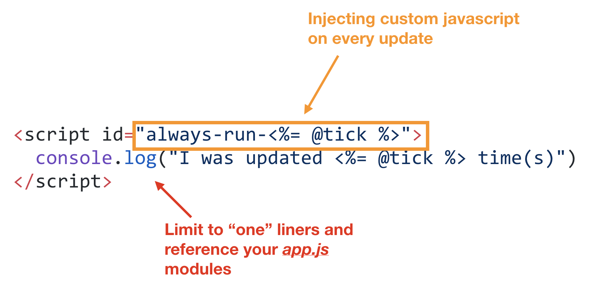
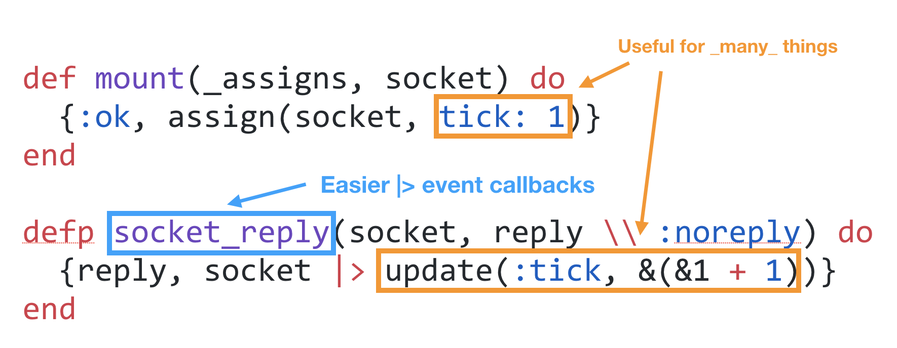
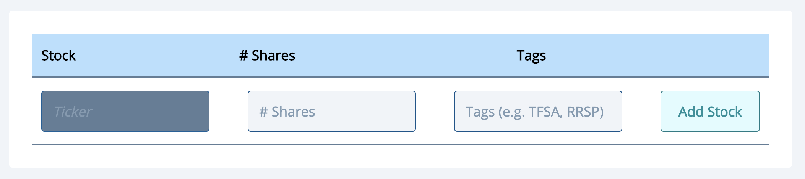
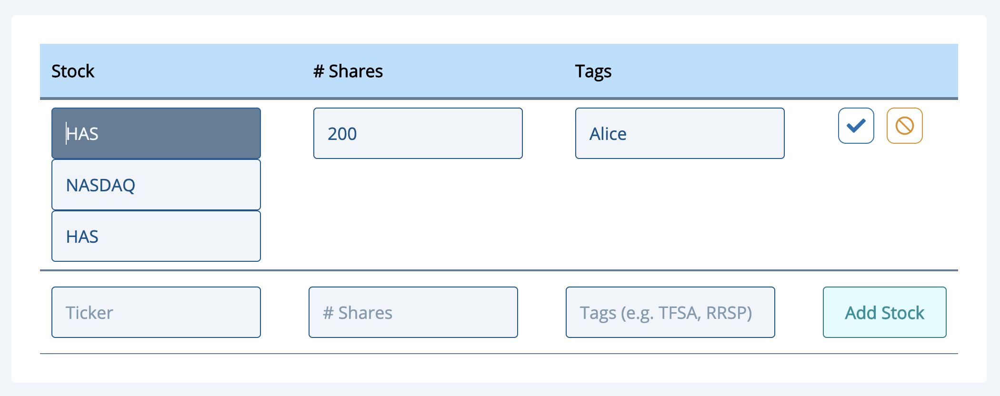

# Run Custom JS on LivePage Reload
#meta datetime 2019-05-20
#meta tags[] elixir liveview empex

## Summary

This article is based on a very early version of LiveView and is no longer
the right way to run Custom JS code.

In your LiveView LEEX, you can add a `script` tag and append a `@tick` to the `id`.
This will force for the MorphDOM differ to always re-render (aka re-run) that code on the client.



## Article

This article is based on a very early version of LiveView and is no longer
the right way to run Custom JS code.

As [part of my talk at EMPEX 2019](http://empex.co/events/2019/conference.html) on [LiveView](https://github.com/phoenixframework/phoenix_live_view), I showed a way to execute custom JavaScript on a LiveView refresh.
So where is how I do it?  If you know a better way, please reach out to me [@a4word](https://twitter.com/a4word) to discuss.

If you don’t know about LiveView, maybe [read more about that first](/articles/liveview-examples)

## Problem

How to force JavaScript to be executed each time my LiveView page
refreshes itself?


## A `tick` on every message

When ever you return data back to the client through the the websocket,
consider adding an auto-incrementer.  This will allow you to uniquely track every _liveview_ refresh.



In friendly copy and paste code...

```elixir
def mount(_params, _session, socket) do
  {:ok, assign(socket, tick: 1)}
end

defp socket_reply(socket, reply \\ :noreply) do
  {reply, socket |> update(:tick, &(&1 + 1))}
end
```

This is useful for a bunch of things, but let’s focus on running our custom javascript.

## Reference that `@tick` in your `<script id="xxx">...</script>`

In your LiveView LEEX, you can add a `script` tag and append the `@tick` to the `id`.   This will force for the MorphDOM differ to always re-render (aka re-run) that code on the client.


In friendly copy and paste code...

```eex
<script id="always-run-<%= @tick %>">
  console.log("I was updated <%= @tick %> time(s)")
</script>
```

Now on every refresh, the code above will be executed, even if the internals of the code block did not change.

### Why? Why! Why?!?

The code above is not that compelling.  But here is a more compelling one.
Focus.  Focusing multiple times on an input using HTML is not (well?)
supported.  At [Dividends.io](https://dividends.io), we wanted to
have a _smart_ focus so that when you were editing your portfolio,
the system smartly put focus on the most appropriate input.

So when the page loads, but focus on the input.  This can totally be done without
JavaScript and plain old `autofocus` works well.



But, when you want to edit a particular stock, for example, we want to put focus on _that_ input.



And once done editing, put focus back on the original _new_ input.

This was accomplished with the following code


In friendly copy and paste code...

```javascript
<script id="autofocus-me-<%= @tick %>">
  <% input_id = case assigns[:index] do
    nil -> "autofocus-new"
    i -> "autofocus-edit-{i}" // should be #
  end %>
  document.getElementById("<%= input_id %>").focus();
</script>
```

A few caveats.

First, LiveView continues to evolve, so please check out the inter
webs to see if this is still a valid approach (and if not, let me know).

Second, don’t write lots of this kind of JavaScript.
If it hurts, you might not be doing it right so maybe consider
taking a step back and trying to figure out what exactly are you
trying to achieve and will this approach do as you expect.

Happy LiveViewing.
