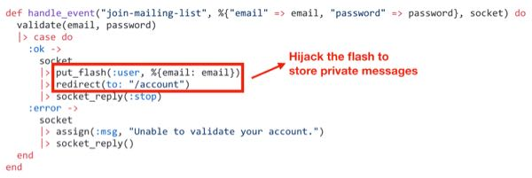
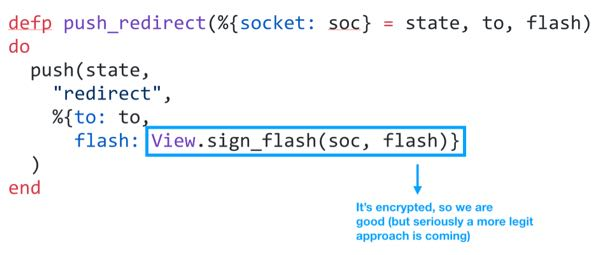
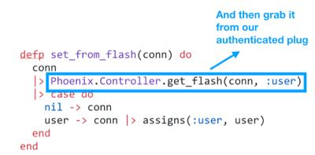

# LiveView storing Session Data on Redirect
#meta datetime 2019-05-21
#meta tags[] elixir liveview empex

## Summary

This article is based on a very early version of LiveView and
is here for historical purposes only.

How can you have your LiveView login form update the user's
session across pages?



## Article

This article is based on a very early version of LiveView and
is here for historical purposes only.

As [part of my talk at EMPEX 2019](http://empex.co/events/2019/conference.html) on [LiveView](https://github.com/phoenixframework/phoenix_live_view),
I showed a (hackish) way of using encrypted `:flash` messages as a means
to communicate information from the LiveView websocket to the Connection Session.
If you know a better way, please reach out to me [@a4word](https://twitter.com/a4word) to discuss.

If you don't know about LiveView, maybe [read more about that first](/articles/liveview-examples)

### Problem

How can you have your LiveView login form update the user's
session across pages?

### Sockets do not store Sessions

LiveView makes it easy to roll out interactive forms without having to
write custom JavaScript.  But what if that form wants to store a `user`
record in Session to keep her logged in between pages.

Yes, you could create a single-page-app (SPA) and have the socket maintain
the state.  But, we are not building a SPA here.

The reason this is not straight straight forward is that LiveView
communicates with your server through a WebSocket Channel, but your
sessions are managed using Connection (aka `conn`) Session.  So we need
a way to securely tell LiveView connection on `redirect` that our user
is logged in.

### Sharing Flash Messages

In web applications, when you do something great (or terrible perhaps)
most frameworks (Phoenix included) allow you to drop a one-time message
into your flow, typically called [Flash Messages](https://hexdocs.pm/phoenix/controllers.html#flash-messages)

Here's a typical usage (non-LiveView).

```elixir
defmodule HelloWeb.PageController do
  ...
  def index(conn, _params) do
    conn
    |> put_flash(:info, "Welcome to Phoenix, from flash info!")
    |> put_flash(:error, "Let's pretend we have an error.")
    |> render("index.html")
  end
end
```

Two interesting things to note:

* Phoenix does not care about the keys you use.
* Flash messages can be complex structures (just so long as they can be JSON encoded)

So, we could just as easily store a flash message like

```elixir
defmodule HelloWeb.PageController do
  ...
  def index(conn, _params) do
    conn
    |> put_flash(:info, %{title: "Welcome to Phoenix", subtitle: "One time flash info!")
    |> render("index.html")
  end
end
```

And then in your template you can unwrap the flash message

```elixir
<%= if msg = get_flash(@conn, :info) do %>
  <h1><%= msg[:title] %></h1>
  <h2><%= msg[:subtitle] %></h2>
<% end %>
```

### LiveView Flash

To _break out_ of LiveView, you can redirect to a new page.
At it's simplest it looks like

```elixir
{:stop, socket |> redirect(to: "/somewhere_else")}
```

And this supports adding Flash messages, for example

```elixir
{:stop,
 socket
 |> put_flash(:info, "Welcome")
 |> redirect(to: "/account")
}
```

If you dig into the Phoenix and LiveView code, you will see that
this information is encrypted between the server and client to
avoid the client _writing_ their own flash messages.



### Using Flash to pass along login success

Knowing that the flash messages can contain any JSONable record, and that
those messages are encrypted, we can use that that flash information
from the LiveView genserver back to the server.


In friendly copy and paste code...

```elixir
def handle_event("join-mailing-list", %{"email" => email, "password" => password}, socket) do
  validate(email, password)
  |> case do
    :ok ->
      socket
      |> put_flash(:user, %{email: email})
      |> redirect(to: "/account")
      |> socket_reply(:stop)
    :error ->
      socket
      |> assign(:msg, "Unable to validate your account.")
      |> socket_reply()
  end
end

defp socket_reply(socket, reply \\ :noreply), do: {reply, socket}
```

On the server connection, we can then look at the `:user` flash message
to check if we were logged in from LiveView



In friendly copy and paste code...

```elixir
defp set_from_flash(conn) do
  conn
  |> Phoenix.Controller.get_flash(conn, :user)
  |> case do
    nil -> conn
    user -> conn |> assigns(:user, user)
  end
end
```

As LiveView evolves, this process for managing session between the
socket and the session might change.  For now, this mechanism works
and I believe provides a secure means of supporting session control
between pages when using LiveView.
