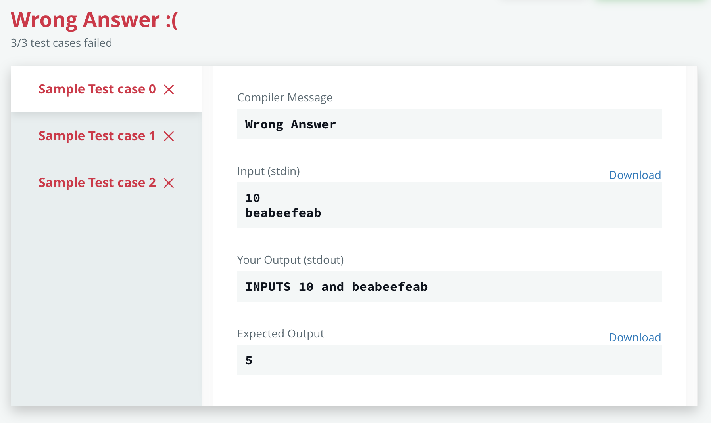

# HackerRank Template in Elixir
#meta datetime 2019-05-27
#meta tags[] elixir hackerrank

## Summary

Here's a template for answering HackerRank in Elixir.  This is
based on the [Two Character](https://www.hackerrank.com/challenges/two-characters/problem)
question

```elixir
defmodule Solution do
  def go() do
    num = input(:int)
    text = input(:string)
    IO.puts("INPUTS # {num} and # {text}")
  end

  def input(:string), do: IO.read(:line) |> String.trim()
  def input(:int), do: input(:string) |> String.to_integer()
end

# Now run your code
Solution.go()
```

Now go forth and HackerRank!!!

## Article

A colleague of mine sent me a link to a hacker rank challenge
called [Two Character](https://www.hackerrank.com/challenges/two-characters/problem)

While giving it a try, I noticed no [Elixir](https://elixir-lang.org/) solution (yet!).
Here's what the template solution looks like

```elixir
defmodule Solution do
#Enter your code here. Read input from STDIN. Print output to STDOUT
end
```

Here is how I am structuring my answer.

```elixir
defmodule Solution do
  def go() do
    num = input(:int)
    text = input(:string)
    IO.puts("INPUTS # {num} and # {text}")
  end

  def input(:string), do: IO.read(:line) |> String.trim()
  def input(:int), do: input(:string) |> String.to_integer()
end

# Now run your code
Solution.go()
```

When you run against HackerRank, you (properly get)



Notice the OUTPUT properly captured the input (i.e. the code is
working as expected, but not yet as desired).

Now go forth and HackerRank!!!
