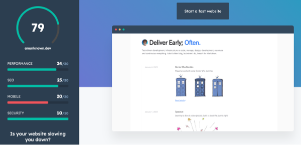

# Analysing your website with Hubspot Website Grader
#meta tags[] seo
#meta datetime 2023-01-14

## Summary

To help ensure my [pesonal websites, like this blog](/articles/new-blog-2023)
are optimzed for the web, I have been using [Hubspot Website Grader®](https://website.grader.com/).

## Article

A snapshot report for [anunknown.dev](https://anunknown.dev) is shown below
[click here to generate a new report](https://website.grader.com/tests/anunknown.dev).

I recently fix an issue on mobile where the width was not correcltly
limitedo the screen width (and would "overhang" allowing a scroll right,
that I did not want).

Still some work to do, as summarized below.

| Category | Performance | Current | Recommendation |
| --- | --- | --- | --- |
| Performance | Image Size |  No | Yes. Use responsive images or SVGs to optimize your images for different screen sizes. |
| SEO | Descriptive Link Text | No | Yes. Use descriptive link text that tells visitors what they'll see if they click the link. |
| Mobile | Tap Targets | No | Yes. Tap targets (e.g., links and buttons) should be at least 8px apart from each other, and at least 48px wide and 48px tall so they are clickable for mobile users. |
