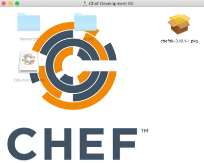
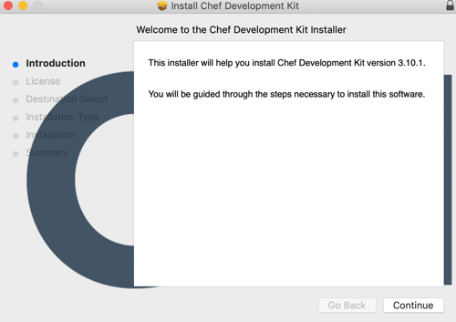

# Getting Started With ChefDK
#meta datetime 2019-05-22
#meta tags[] chef devops

## Summary

I am getting back into [Chef](https://www.chef.io/), and the landscape
seems to have changed quite a bit in the last 10 years.  I am going
to documenting the journey in a series of bite sized articles.

[Official install docs](https://docs.chef.io/install_dk.html) are here.
So follow them, and read along.


## Article

I am getting back into [Chef](https://www.chef.io/), and the landscape
seems to have changed quite a bit in the last 10 years.  I am going
to documenting the journey in a series of bite sized articles.

We will focus on the how, and not so much on the why.  If you are
still in *discovery mode* trying to find the right solution for
your needs, then I suggest you keep looking as Chef might not
be what you need.

The [official docs](https://docs.chef.io/install_dk.html) are here.
Adjust the values accordingly (we are using `sw_vers` to tease out
your Mac OSX version).

```bash
CHEF_VERSION=4.0.60 && \
  CHEF_SUBV=1 && \
  MACOSX_VERSION=$(sw_vers | grep ProductVersion | egrep -o '\d+\.\d+') && \
  curl -o /tmp/chefdk.dmg \
    https://packages.chef.io/files/stable/chefdk/${CHEF_VERSION}/mac_os_x/${MACOSX_VERSION}/chefdk-${CHEF_VERSION}-${CHEF_SUBV}.dmg && \
  open /tmp/chefdk.dmg
```

The latest version is `4.0.60`, please check [ChefDK Releases](https://downloads.chef.io/chefdk)
to get the appropriate version

That should download the SDK for your Mac ([not running OS X then check out the docs](https://docs.chef.io/install_dk.html)).
and popup the installer.



If you click on the `.pkg` that will open up the installer.  Follow the
instructions.



The installed things into `/opt/chefdk`. Let's make the chefdk
tools available from anywhere on your machine by adding it
to your path.

```bash
vi ~/.bash_profile
```

And in there add a line that looks like the following

```bash
...
PATH="/opt/chefdk/bin:$PATH"
...
export PATH
```

If everything worked as expected then open up a new terminal, and
check the version of your installed `chef`

```bash
chef -v
```

The output should look similiar to

```bash
Chef Development Kit Version: 3.10.1
chef-client version: 14.12.9
delivery version: master (9d07501a3b347cc687c902319d23dc32dd5fa621)
berks version: 7.0.8
kitchen version: 1.24.0
inspec version: 3.9.3
```

If you want to see all the tools available, then run

```bash
ls -1a /opt/chefdk/bin/
```

And the output should be similar to

```bash
.
..
.gitkeep
berks
chef
chef-apply
chef-client
chef-resource-inspector
chef-run
chef-shell
chef-solo
chef-vault
cookstyle
dco
delivery
foodcritic
inspec
kitchen
knife
ohai
print_execution_environment
push-apply
pushy-client
pushy-service-manager
```
