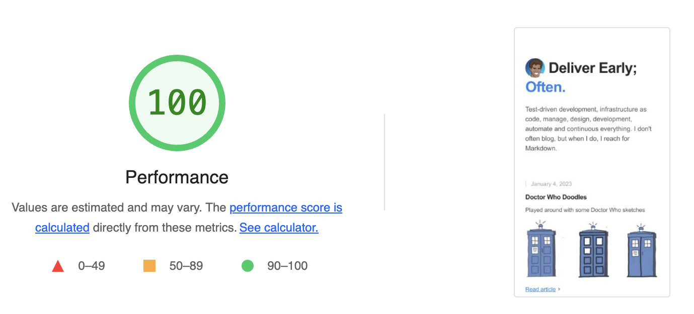
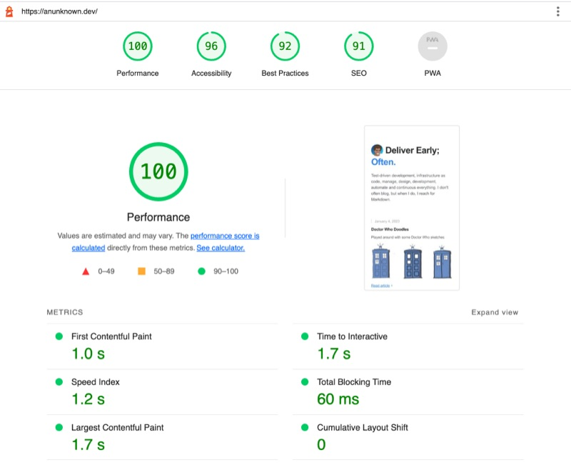
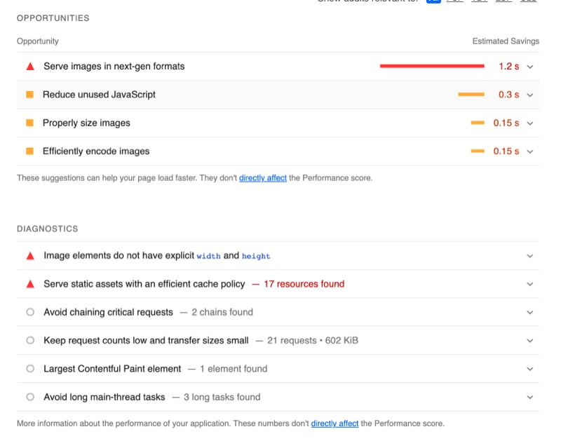

# Analysing your website with Lighthouse SEO (Chrome Plugin)
#meta tags[] seo chrome-plugin
#meta datetime 2023-01-15

## Summary

Having recently [re-worked by personal blog](/articles/new-blog-2023),
I recently stumbled upon
[Lighthouse](https://chrome.google.com/webstore/detail/lighthouse/blipmdconlkpinefehnmjammfjpmpbjk).
It is geared towards _improving SEO_, but really it is does a great
job at helping create an _optimized website_ in terms of performance,
accessibility, and bugs.

## Article

Having recently [re-worked by personal blog](/articles/new-blog-2023),
I recently stumbled upon
[Lighthouse](https://chrome.google.com/webstore/detail/lighthouse/blipmdconlkpinefehnmjammfjpmpbjk).
It is geared towards _improving SEO_, but really it is does a great
job at helping create an _optimized website_ in terms of performance,
accessibility, and bugs.

A snapshot report for [anunknown.dev](https://anunknown.dev) is shown below
[click here to generate a new report](https://googlechrome.github.io/lighthouse/viewer/?psiurl=https%3A%2F%2Fanunknown.dev%2F&strategy=mobile&category=performance&category=accessibility&category=best-practices&category=seo&category=pwa&utm_source=lh-chrome-ext).

[From the plugin itself](https://chrome.google.com/webstore/detail/lighthouse/blipmdconlkpinefehnmjammfjpmpbjk)
is an open-source, automated tool for improving the performance, quality, and correctness of your web apps.

When auditing a page, Lighthouse runs a barrage of tests against the page, and then generates a report on how well the page did. From here you can use the failing tests as indicators on what you can do to improve your app.

* [Quick-start guide on using Lighthouse](https://developers.google.com/web/tools/lighthouse/)
* [View and share reports online](https://googlechrome.github.io/lighthouse/viewer/)
* [Github source and details](https://github.com/GoogleChrome/lighthouse)

But even at 100%, there are always opportunities for improvements.

