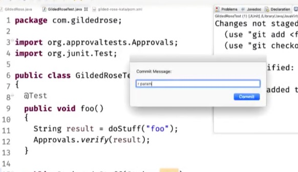
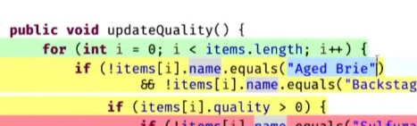

# Falco "From 0% to 100% tested code"
#meta datetime 2019-05-15
#meta tags[] video-summaries testing

## Summary

[](https://www.youtube.com/watch?feature=player_embedded&v=wp6oSVDdbXQ)

Gives you some legacy code to practice.

The video goes through the [Gilded Rose Kata](https://github.com/emilybache/GildedRose-Refactoring-Kata) to add the following feature.

## Article

[](https://www.youtube.com/watch?feature=player_embedded&v=wp6oSVDdbXQ)

Gives you some legacy code to practice.

The video goes through the [Gilded Rose Kata](https://github.com/emilybache/GildedRose-Refactoring-Kata) to add the following feature.

```
"Conjured" items degrade in Quality twice as fast as normal items.
```

And again with Kent Beck

```
Make the change easy, and then make the easy change.
Warning: the first part might be hard.
- Kent Beck
```

The working with old code uses the [Arlo's commit notation](https://github.com/RefactoringCombos/ArlosCommitNotation)

| prefix | meaning |
| --- | --- |
| F | Feature |
| B | Bug |
| t | Test only |
| r | Proveable refactor |
| a | Automated |
| !!! | Non-proveable refactor |

Assigns risk to the comments `F` and `B` and `!!!` introduce risk, the lower case `t`, `r` and `a` are safe.

Falco is using a tool to support [Test-Commit-Revert](https://medium.com/@kentbeck_7670/test-commit-revert-870bbd756864), where every day is committed if it the tests pass.



Much of the first part of the talk is about _documenting_ through tests the behaviour of the existing method, and using a coverage tool here is very helpful in showing that you have (well) covered all the existing code before you try and change it.



It takes about 20 lines of code and 400 _tests_ until 100% coverage is achieved and we can start to do actual work.

That actual work involved 2 main refactorings

* Lift Conditional Refactor
* [Add Explicit Return](https://github.com/digdeeproots/provable-refactorings/blob/master/recipes/micro-step-helpers/add-explicit-return/cpp.md)

After almost a hundred commits, one `F`eature commit with 2 lines of code were added.

Resources

* [ApprovalTests](https://approvaltests.com)
* [Arlo's commit notation](https://github.com/RefactoringCombos/ArlosCommitNotation)
* [Gilded Rose Kata](https://github.com/emilybache/GildedRose-Refactoring-Kata)
* [Test-Commit-Revert](https://medium.com/@kentbeck_7670/test-commit-revert-870bbd756864)
* [Add Explicit Return](https://github.com/digdeeproots/provable-refactorings/blob/master/recipes/micro-step-helpers/add-explicit-return/cpp.md)