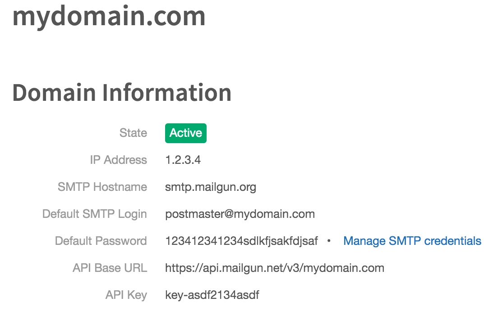
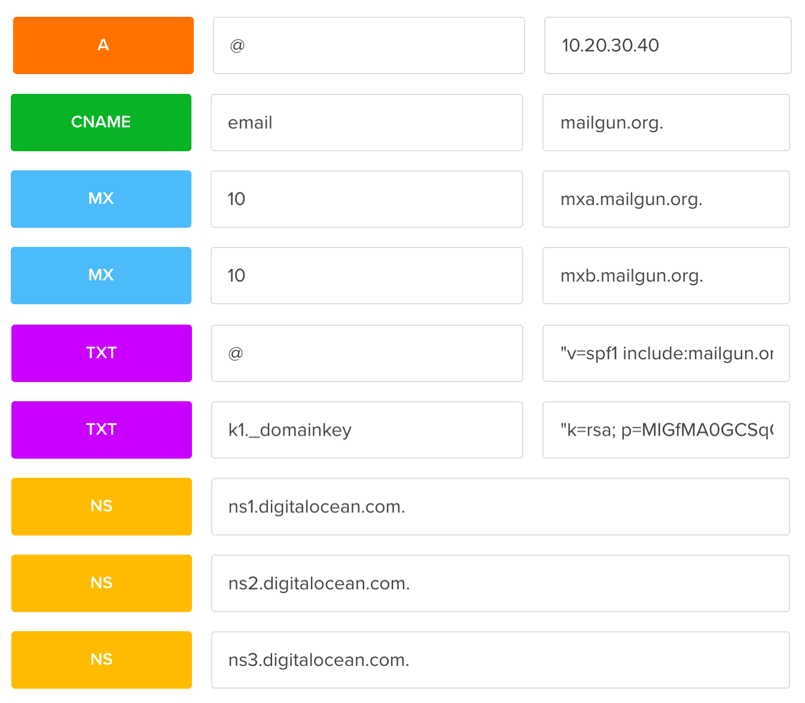
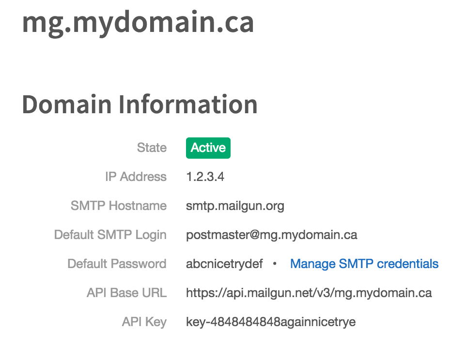
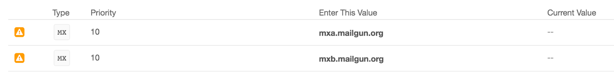
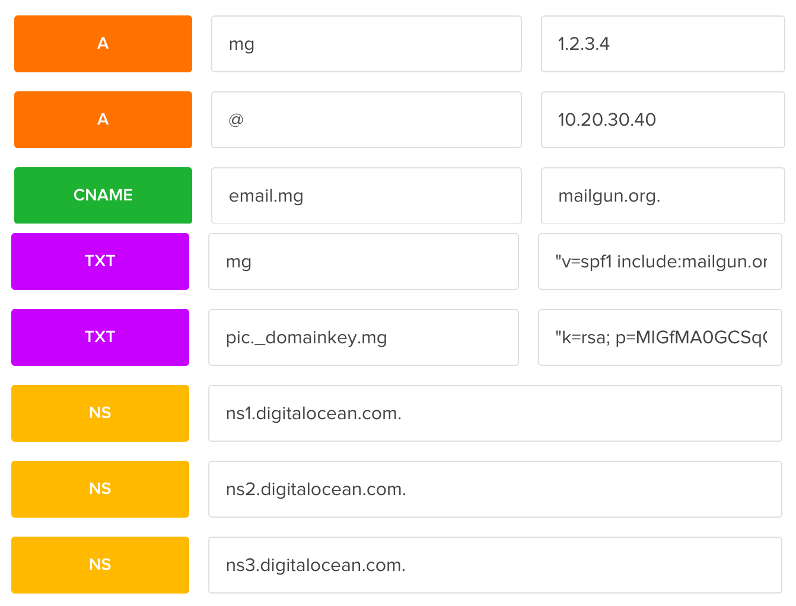
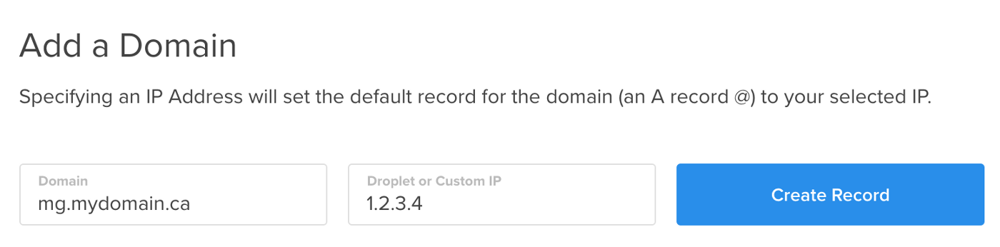
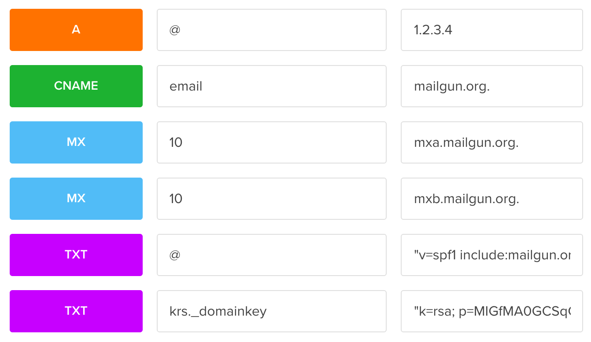
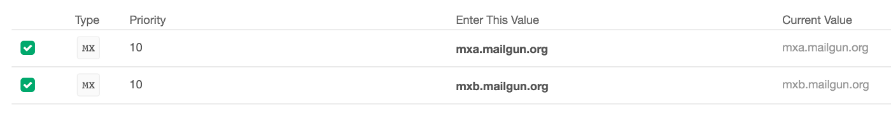

# Setting up Mailgun on Digital Ocean
#meta datetime 2015-12-03
#meta tags[] mailgun digitalocean

## Summary

Not having to manage an email server is awesome, thank you [Mailgun](https://www.mailgun.com). I am currently integrating with [Digital Ocean](https://m.do.co/c/e450543d2a29) and ran into some documentation confusion with DNS records, especially when trying to configure for a subdomain.

This article combines a few sources to _finally_ get a working
solution for sending/receiving emails on [Digital Ocean](https://m.do.co/c/e450543d2a29)
via [Mailgun](https://www.mailgun.com).

## Article

Not having to manage an email server is awesome, thank you [Mailgun](https://www.mailgun.com). I am currently integrating with [Digital Ocean](https://m.do.co/c/e450543d2a29) and ran into some documentation confusion with DNS records, especially when trying to configure for a subdomain.

After following [Mailgun’s instructions](https://help.mailgun.com/hc/en-us/articles/202052074-How-do-I-verify-my-domain-) (including the [Digital Ocean guide](https://www.digitalocean.com/community/questions/how-to-set-up-a-host-name-in-digitalocean), [alternate guide](https://code.krister.ee/mailgun-digitalocean/), and [community help](https://www.digitalocean.com/community/questions/failed-to-verify-domain-on-mailgun)) I was able to get it setup.

Note that all links to [Digital Ocean](https://m.do.co/c/e450543d2a29) are using my referral link.

### Configure Your Domain

If you are setting up your account directly against your domain, then things are a bit easier (and the instructions work a little more as expected). If you are setting up against a subdomain, skim this section as the subdomain instructions are a bit different.



I wanted to provide my view of how to get things configured should the *shorthand* editor in [Digital Ocean](https://m.do.co/c/e450543d2a29) change between now and when you are reading me.

This is what the Zone file looks like to confirm mydomain.com for sending and receiving emails using [Mailgun](https://www.mailgun.com).

```bash
$ORIGIN mydomain.com.
$TTL 1800
mydomain.com. IN SOA ns1.digitalocean.com. hostmaster.mydomain.com. 123412341234 10800 3600 604800 1800
mydomain.com. 1800 IN NS ns1.digitalocean.com.
mydomain.com. 1800 IN NS ns2.digitalocean.com.
mydomain.com. 1800 IN NS ns3.digitalocean.com.
mydomain.com. 1800 IN A 10.20.30.40
mydomain.com. 1800 IN MX 10 mxa.mailgun.org.
mydomain.com. 1800 IN MX 10 mxb.mailgun.org.
mydomain.com. 1800 IN TXT “v=spf1 include:mailgun.org ~all”
k1._domainkey.mydomain.com. 1800 IN TXT “k=rsa; p=ABC1234+DEF/aSDF@!#$/FWAEF”
email.mydomain.com. 1800 IN CNAME mailgun.org.
```

[Digital Ocean](https://m.do.co/c/e450543d2a29)’s data entry provides shortcuts in the editor, so be sure to leave out mydomain.com, and use the @ symbol where necessary. Here’s what the values look like in [Digital Ocean](https://m.do.co/c/e450543d2a29)’s editor



Please note that 10.20.30.40 is the IP address of your droplet and NOT that provided by mailgun.

### Sending Emails (Not Receiving) From Your Sub Domain

If you want to keep your primary domain free and clear from [Mailgun](https://www.mailgun.com), you might consider setting up a subdomain to route all email through.



Please note that in this example I have NOT configured the MX records, and you will not be able to receive emails. This is because at the moment [Digital Ocean](https://m.do.co/c/e450543d2a29) does not directly support subdomain MX records. If you do configure your MX records, your account will still show as active, but the MX records will not be configured as you expect in Mailgun.



Skip to the next section if you will want to both send AND receive emails from your subdomain. See [here](https://www.digitalocean.com/community/questions/mx-record-for-subdomains) and [here](https://www.digitalocean.com/community/questions/sub-domains-with-mx-records-for-mailgun) for discussions about the limitations in the DNS editor.

This is what the Zone file looks like to confirm *mydomain.ca* with a sub domain of *mg.mydomain.ca* for sending emails using [Mailgun](https://www.mailgun.com).

```bash
$ORIGIN mydomain.ca.
$TTL 1800
mydomain.ca. IN SOA ns1.digitalocean.com. hostmaster.mydomain.ca. 123412341234 10800 3600 604800 1800
mydomain.ca. 1800 IN NS ns1.digitalocean.com.
mydomain.ca. 1800 IN NS ns2.digitalocean.com.
mydomain.ca. 1800 IN NS ns3.digitalocean.com.
mg.mydomain.ca. 1800 IN A 1.2.3.4
mydomain.ca. 1800 IN A 10.20.30.40
mg.mydomain.ca. 1800 IN TXT “v=spf1 include:mailgun.org ~all”
pic._domainkey.mg.mydomain.ca. 1800 IN TXT “k=rsa; p=MIGfMA0GCSqGSASDFASDFASDFBiQKBgQC+v78XOweoD+JGrE8STwHLQaxX310gDHAgK2IaJ/TEGZ4GS5xr/sb/AxX+crzEkMDp9e58PASDFASDFASDFASDFASDFQ9r4I/ni3LDC+ORkBzzmy3syU7UKCN3fRKPba4d8fvIE/GvqTGnuJuwDeLZ8lJfIfwIDAQAB”
email.mg.mydomain.ca. 1800 IN CNAME mailgun.org.
```

[Digital Ocean](https://m.do.co/c/e450543d2a29)’s data entry provides shortcuts in the editor, so you will want to leave out mydomain.ca, but **NOT** mg. Here’s what the values look like in [Digital Ocean](https://m.do.co/c/e450543d2a29)’s editor.



Here’s what you need to change for your specific configuration

* A record for mg should by the IP provided by mailgun (not 1.2.3.4)
* A record for @ should be your droplets’ IP (not mailgun’s)
* TXT record for mg should be wrapped in quotes
* TXT record for pic.\_domainkey.mg should also be wrapped in quotes

### Sending And Receiving Emails From Your Sub Domain

If you wish to receive emails from mg.mydomain.com, then you have a little bit more work to do.

First, you will need to create an entirely new domain for your subdomain in [Digital Ocean](https://m.do.co/c/e450543d2a29)



The IP address of 1.2.3.4 should that from [Mailgun](https://www.mailgun.com) and NOT your droplet’s IP. Here is what the records will look like in editor.



In the above the 1.2.3.4 IP address is the one provided by Mailgun, and NOT your DigitalOcean droplet. Once those settings propagate you should be able to receive emails from @mg.mydomain.com.



Do not copy and paste anything from this post, and instead use the values provided by [Mailgun](https://www.mailgun.com).

Happy Emailing.