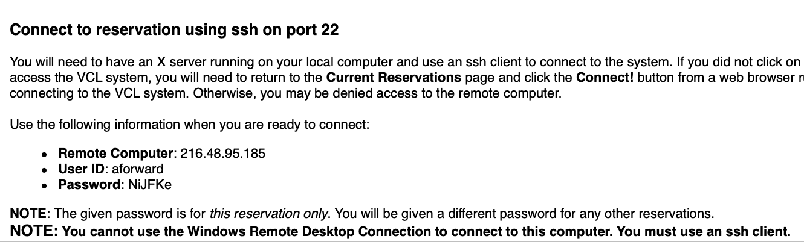
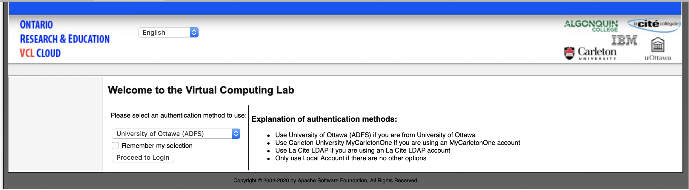
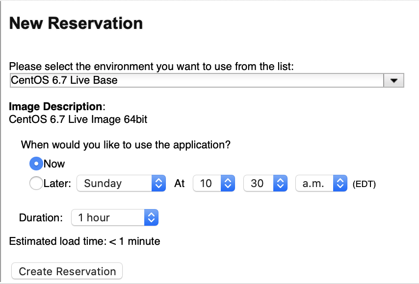
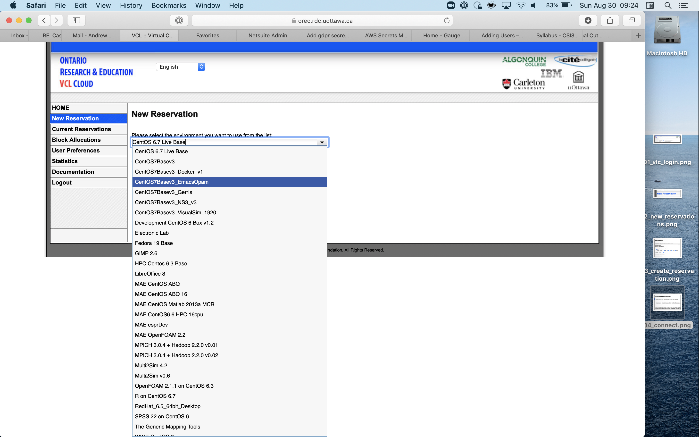
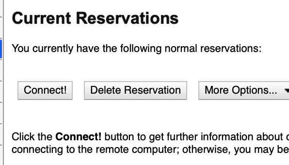

# Running OCAML on UOttawa VCL
#meta datetime 2020-08-30
#meta tags[] ocaml

## Summary

Let's get up and running with [OCaml](https://ocaml.org) and the [Ontario Reasearch
& Education VCL Cloud](https://orec.rdc.uottawa.ca/vcl/index.php).
Visit the [VCL Cloud](https://orec.rdc.uottawa.ca/vcl/index.php) and
create a new reservation for `CentOS7Basev3_EmacsOpam`.  Once
ready, then you can SSH into your devbox and access OCaml.



## Article

Let's get up and running with OCaml and the Ontario Reasearch
& Education VCL Cloud.

### VCL Cloud

Go visit the VCL Cloud home page

* https://orec.rdc.uottawa.ca/vcl/index.php



### Create A Reservation


Figure out how long you want the server for.



Make sure you grab the correct version `CentOS7Basev3_EmacsOpam`.



And now you can connect



When the box is ready, you will be given the necessary login instruction


### SSH Client

If you are running on Windows then you might not have an `SSH client`
available (if that's no longer the case, please let me know).

Here are two possible clients to log into the machine

* [Bitvise](https://www.bitvise.com/ssh-client-download)
* [VcXsrv](https://sourceforge.net/projects/vcxsrv/)
* [MobaXterm](https://mobaxterm.mobatek.net)

If you are on a Mac, then open `Terminal` and you can access `SSH`
from the console.

### SSH into the Box

Now that you have an SSH, copy the information from VLC to
log into your newly reserved box.  DO NOT BLINBLY COPY the details
below as your username and password will be different.

```bash
$ ssh aforward@216.48.95.185
```

You will be asked about the authenticity of the host, to proceed
you will have to say "yes"

```
The authenticity of host '216.48.95.185 (216.48.95.185)' can't be established.
ECDSA key fingerprint is SHA256:ED0vMKplAN3JZycg1F1ltpOEp7/9rtoMer0+STCgGc0.
Are you sure you want to continue connecting (yes/no/[fingerprint])? yes
Warning: Permanently added '216.48.95.185' (ECDSA) to the list of known hosts.
```

Now you can enter the _one-time use_ password

```bash
aforward@216.48.95.185's password:
```

And now we care

```bash
[aforward@localhost ~]$ ocaml --version
The OCaml toplevel, version 4.05.0
```