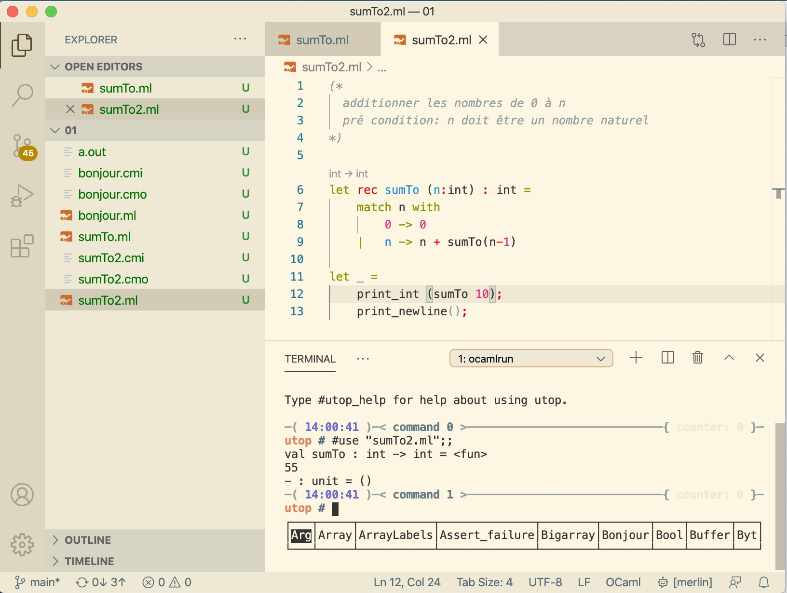
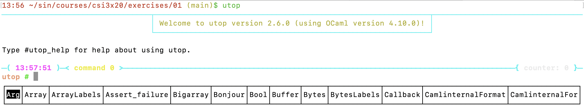
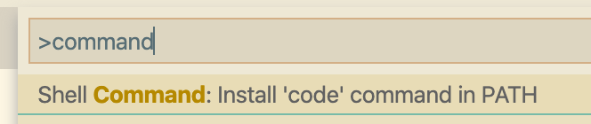
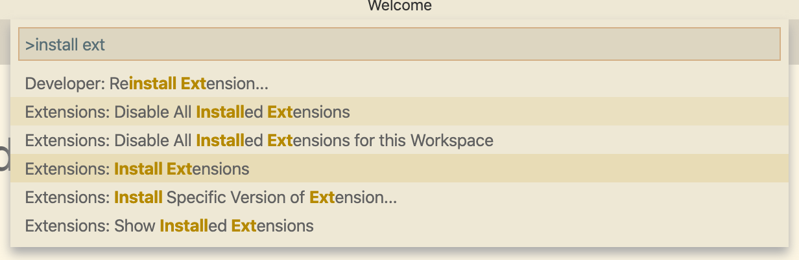
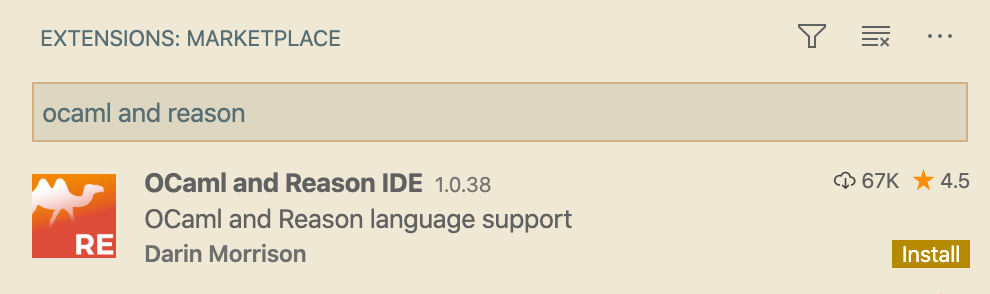

# Configure VS Code to run OCAML a Mac OSX
#meta datetime 2020-08-30
#meta tags[] ocaml vscode

## Summary

Let's get up and running with OCaml and VS Code on a Mac.



## Article

Let's get up and running with [OCaml](https://ocaml.org) and VS Code on a Mac.

### Install Brew

If you do not have [Brew](https://brew.sh) installed yet, then here
is the one-liner you need.

```bash
/bin/bash -c "$(curl -fsSL https://raw.githubusercontent.com/Homebrew/install/master/install.sh)"
```

Please note that running random code is find on the internet is dangerous,
so learn more about [installing brew on a mac](https://docs.brew.sh/Installation)
directly from the [brew.sh](https://brew.sh).

### Install OCAML

Using [brew](https://brew.sh), we can now install [OCaml](https://ocaml.org)

```bash
brew install ocaml
```

Or, if it's already installed, we can upgrade ot the latest

```bash
brew upgrade ocaml
```

As of this time of writing, we are running `The OCaml toplevel, version 4.10.0`

```bash
ocaml --version
```

### Install OPAM Tools

Now we can install [OPAM](https://opam.ocaml.org), the package manager for [OCaml](https://ocaml.org)

```
brew install opam
opam init
```

[Merlin](https://github.com/ocaml/merlin) provides services such as autocompletion to IDEs such as VSCode.

```
opam install merlin
```

[Ocp-indent](https://github.com/OCamlPro/ocp-indent) is a tool for auto-formatting [OCaml](https://ocaml.org) code.

```
opam install ocp-indent
```

[utop](https://opam.ocaml.org/blog/about-utop/) provides a much improved interface to the [OCaml](https://ocaml.org) REPL

```
opam install utop
```

To ensure opam is working as expected, you will want to add the following
to you bash profile (many names such as  `~/.bash_profile`, `~/.bashrc`, `~/.bash_aliases`)

```
eval $(opam env)
```

If you open a new `Terminal` window, you should be able to run `utop`





### Install VS Code

There are many editors out there.  I enjoy using [Sublime Text](https://www.sublimetext.com)
with [Terminus](https://packagecontrol.io/packages/Terminus), but [VS Code](https://code.visualstudio.com) is a great altnerative as you will see below.

Follow [the installation instructions](https://code.visualstudio.com/docs/?dv=osx)
or you can run the script below.

If you don't have `wget`, then install it using brew

```bash
brew install wget
```

Now we can install VSCode.

```bash
cd /tmp
  wget https://go.microsoft.com/fwlink/?LinkID=620882 -O VSCode-darwin-stable.zip && \
  unzip VSCode-darwin-stable.zip && \
  mv "Visual Studio Code.app" /Applications/ # if this fails, run as `sudo ...`
```

To be able to run `code` from Terminal, open up Visual Code.


And then install the command line tools




### Integrate OCAML with VS Code

We are going to use the [OCaml and Reason IDE extension](https://marketplace.visualstudio.com/items?itemName=freebroccolo.reasonml)
which can be installed directly from VS Code.



And search for `OCaml and Reason IDE`.



If everything ran as expected (which is always does), then you should now have a nice IDE for [OCaml](https://ocaml.org) within VS Code.


### Happy Coding!