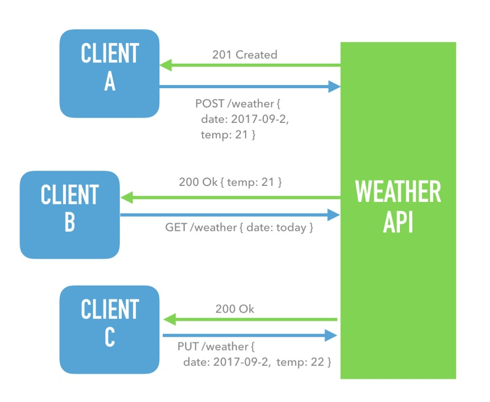
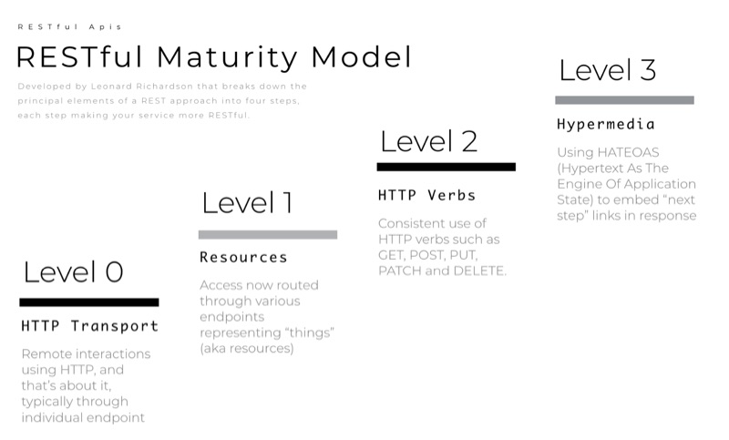
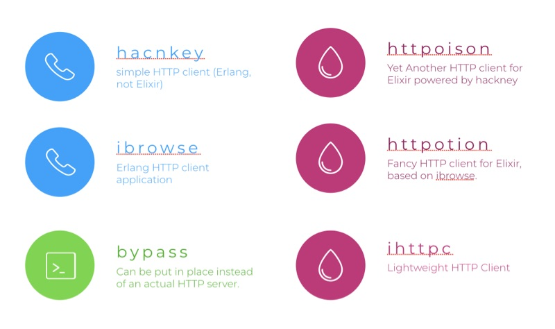
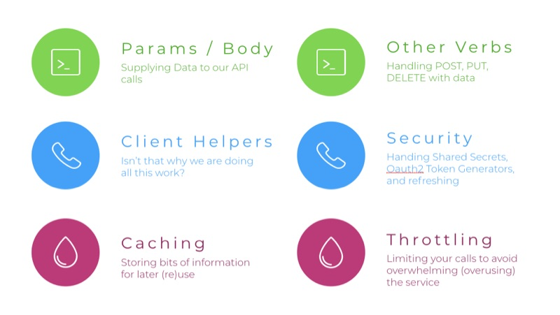

# Oh, the API Clients You'll Build (in Elixir)
#meta datetime 2017-11-27
#meta tags[] talks elixir

## Summary


Today we are going explore how to write API clients in the [Elixir](https://elixir-lang.org) language. This is a follow-up article to my presentation at OpenCamps 2017.

## Article


Today we are going explore how to write API clients in the [Elixir](https://elixir-lang.org) language. This is a follow-up article to my presentation at OpenCamps 2017.

[Elixir](https://elixir-lang.org) is relatively new programming language (v1.0 released in 2014), with one of it's greatest features being that is stands on the shoulders of a giant in Erlang. That said, it is still quite rare to find official support in [Elixir](https://elixir-lang.org) for a lot of your favourite APIs. This leaves you with the task of writing your own, or possibly trying one of the many open source options out there.

In this article, we will look at how you can build your own. The exercise of writing your own has many benefits. First, you learn a bit more about [Elixir](https://elixir-lang.org), the language, and how to leverage a bunch of it features. Second, you learn a bit more about the API you are working with. And finally, you gain some insight into how it could be built so that you can better evaluate the altneratives.

Let's dive in.

### What Do We Mean API?

For starters, API is a very overloaded term. So here, I am referring to RESTful APIs available over HTTP. These are indeed not the only meaning of API, but for this context that is what we are referring to.



In the example above, we have a Weather API and several clients that interact with that API over HTTP. Those clients could be straight curl commands, or more likely a think wrapper written in the programming language like Ruby, Java, or in our case [Elixir](https://elixir-lang.org).

### What is a RESTful API?

A RESTful service was defined back in 2000 by Roy Thomas Fielding as a design approach for network based APIs. Your service can be implemented / provide various levels of RESTful maturity. And the data to communicate with the service is usually JSON, but could also be XML, YAML, Key/Value pairs, etc.

Leonard Richardson provided a nice breakdown of the [principles an a RESTful approach into various maturity levels](https://martinfowler.com/articles/richardsonMaturityModel.html), which was summarized well by Martin Fowler. The higher the level, the more closely you are following the full spirit of REST; but even any HTTP service offering could qualify as REST, just not a very mature implementation.



OK, now let's start talking Elixir.

### Elixir Libraries To Talk HTTP

There are lots of libraries available for interacting with HTTP services. Some in pure elixir, others in Erlang, and bypass is a mocking library to help us test HTTP calls without actually reaching out the service.



We are going to use [httpoison](https://hex.pm/packages/httpoison), it is a pure Elixir library built on top of [hackney](https://hex.pm/packages/hackney) and provides a very approachable interface.

Here's how to make a GET request out to a public API.

```elixir
iex> HTTPoison.get!("https://api.github.com")
%HTTPoison.Response{
  status_code: 200,
  headers: [{"content-type",
  "application/json"}],
  body: "{…}"}
```

The response is an Elixir structure that includes what you would expect like the status_code, response headers and the body (aka the return data).

Notice the `!` on the method name, that is a convention to return the data, or if it fails then raise an error. The error friendly version will return a `{:ok, data}` or `{:error, reason}` response.

```elixir
iex> HTTPoison.get("https://api.github.com")
{:ok, %HTTPoison.Response{}}
```

And if things fail, the response might look similar to

```elixir
iex> HTTPoison.get("ppq://url.com")
{:error, %HTTPoison.Error{reason: :nxdomain}}
```

Now that we know how to make simple HTTP calls, we are ready to build our very own client.


### Creating Our Elixir Client

Here is a first attempt at wrapping an HTTP get call in a client method.

```elixir
def get(url, headers \\ []) do
  case HTTPoison.get(url, headers) do
    {:ok, %{body: raw_body, status_code: code}} -> {code, raw_body}
    {:error, %{reason: reason}} -> {:error, reason}
  end
end
```

In the above, we are delegating the underlying call to `HTTPoision.get` and then using a `case` statement to pattern match on the two types of responses. We can now make our call API call using our new method.

```elixir
iex> Myclient.get("https://api.github.com")
{200, %{...}}
```

You can access the Myclient example on Github, and follow along with…

```bash
$ git clone git@github.com:work-samples/myclient.git
$ cd myclient
$ mix deps.get
$ iex -S mix
```

### Decoding the Raw Response

The response from our API is in it's most raw form, in the case of the GitHub API it's an encoded JSON string. This is not very usable within our Elixir client, so we much rather have something that we can manipulate more directly. For this, we will use poison, an Elixir library for dealing with JSON.

Here's an example of decoding a JSON string into an Elixir map.

```elixir
iex> Poison.decode("{\"a\": 1}", keys: :atoms)
{:ok, %{a: 1}}
```

You will notice that Poison follow a similar pattern of :ok and :error response tuples.

Let's incorporate that into our get method from above. But first, let's refactor it a bit into it's parts.

```elixir
def get(url, headers \\ []) do
  url
  |> HTTPoison.get(headers)
  |> case do
      {:ok, %{body: raw, status_code: code}} -> {code, raw}
      {:error, %{reason: reason}} -> {:error, reason}
     end
  |> (fn {ok, body} ->
        body
        |> Poison.decode(keys: :atoms)
        |> case do
             {:ok, parsed} -> {ok, parsed}
             _ -> {:error, body}
           end
      end).()
end
```

### But What About Non JSON Data

Usually an API client needs only worry about one data format, but there are occasions where there might be various formats returned. How are we going to deal with that?

Well, part of a response from the API, which until now we have ignored, are the return headers. And burried deep in there the API will tell you the Content-Type.

```elixir
[{"Server", "GitHub.com"},
 {"Content-Type", "application/json; charset=utf-8"},
 {"Content-Length", "2039"},
 {"Status", "200 OK"},
 {"X-RateLimit-Limit", "60"},
 {"X-RateLimit-Remaining", "44"},
 {"X-RateLimit-Reset", "1510586818"},
 {"X-GitHub-Request-Id", "6FA8:11F9:41D7744:86CB6AE:5A09B817"}]
```

So now we can extract the content type and use that decode the response from our API.

But before we tack that only our get method, let's refactor it into it's main parts.

```elixir
def get(url, headers \\ []) do
  url
  |> call(headers)
  |> content_type
  |> decode
end
```

The `call` function will perform the underlying HTTP call, and the `content_type` function will extract the content type and finally our decode function will take that information and try to `decode` everything into an Elixir data structure.


### Implementing call

Our call function really has not changed much from above, but we are now returning the headers in addition to the status_code and raw body.

```elixir
def call(url, headers \\ []) do
  url
  |> HTTPoison.get(headers)
  |> case do
       {:ok, %{body: raw, status_code: code, headers: headers}} ->
         {code, raw, headers}
       {:error, %{reason: reason}} -> {:error, reason, []}
    end
end
```


### Implementing content_type

Here' s how we implement the content_type function.

First, we want to keep the information above, so we have a pass-through function that will keep the status_code and raw body untouched. We will pattern match on the desired tuple returned from call above.

```elixir
def content_type({ok, body, headers}) do
  {ok, body, content_type(headers)}
end
```

But the acutal implementation will just focus on the headers list. We can implement this function in three parts. The first function matches an empty list, so if the API didn't provide us with a content-type, then we will default to JSON.

```elixir
def content_type([]), do: "application/json"
```

The second function matches a list (in head/tail syntax) where we have located the content-type. In this case, we want to tease out any additional meta information (such a the character set) and just return the type.

```elixir
def content_type([{"Content-Type", val} | _]) do
  val
  |> String.split(";")
  |> List.first
end
```

The last function matches a list again, but here it's not the content-type, so we want to check the rest of the list.

```elixir
def content_type([_ | t]) do: content_type(t)
```

### Implementing decode

Now that we have the status code, the raw data and the content-type, we can implement our decode function.

First, our JSON implementation will remain relatively unchanged from above.

```elixir
def decode({ok, body, "application/json"}) do
  body
  |> Poison.decode(keys: :atoms)
  |> case do
       {:ok, parsed} -> {ok, parsed}
       _ -> {:error, body}
     end
end
```

But now, we can add more decoders based on the types of data the API returns. For example, here is how we could handle an XML response.

```elixir
def decode({ok, body, "application/xml"}) do
  try do
    {ok, body |> :binary.bin_to_list |> :xmerl_scan.string}
  catch
    :exit, _e -> {:error, body}
  end
end
```

We are using an Erlang function directly, and in this implementation we catch the `:exit` code that is raised if the XML is not well formed and instead wrap it in our consistent `{:error, reason}` response.

Finally, if we don't understand the encoded, we will pass the raw body through, as such.

```elixir
def decode({ok, body, _}), do: {ok, body}
```

### Playing With Our Own Server

Instead of poking at the GitHub API, we are now going to change focus to use a companion project myserver.

You can access Myserver example on Github, and follow along with …

```bash
$ git clone git@github.com:work-samples/myserver.git
$ cd myserver
$ mix deps.get
$ mix run --no-halt
```

Let's use Myclient to access our server.

```elixir
iex> Myclient.get("http://localhost:4000")
{200, %{version: "0.1.0"}}
```

We are well on our way to implementing a full fledged client.

But not really.



We have gone pretty far with our spike, but have not really talked about how we can test our client. Or, how to send data to the API. Or, how to handle those other API calls like `POST` and `PUT` and `DELETE`. Or, how to handle accessing protected API endpoints, using something like secure tokens or an OAuth2 like protocol.

Let's address some fo these concerns in more detail, and others will be left to the reader to explore on their own.

### Sending Data To The API

Sending data to the API is relatively straight forward, we just need to support additional arguments, one for the query parameters (such as `?user=sarah&filter=topTen`).

```elixir
def call(url, query_params \\ %{}, headers \\ []) do
  url
  |> HTTPoison.get(headers, params: query_params)
  |> case do
      {:ok, %{body: raw, status_code: code, headers: headers}} ->
        {code, raw, headers}
      {:error, %{reason: reason}} -> {:error, reason, []}
     end
end
```

To support adding data to the body, such as `{"name": "James", "role": "admin"}`, a similar approach would be followed.


### Supporting POST, PUT, DELETE, etc

To support multiple verbs as they are called in HTTP lingo, we need to re-work our underlying call to HTTPoison.

```elixir
def call(url, method, body \\ "", query_params \\ %{}, headers \ []) do
  HTTPoison.request(
    method,
    url |> clean_url,
    body |> encode(content_type(headers)),
    headers |> clean_headers,
    query_params |> clean_params
  )
  |> case do
      {:ok, %{body: raw, status_code: code, headers: headers}} ->
        {code, raw, headers}
      {:error, %{reason: reason}} -> {:error, reason, []}
     end
end
```

A bunch for of things are going on here, and we will discuss each in some detail.

#### Cleaning the URL

First **clean_url** is a helper method to deal with a bug-feature in underlying httpoison API, but it also provides a few other capabilities. I leave it to the reader to review the code to see what else it is doing.

#### Encoding the Data

Second, we need to encode the data for transport. We can use the same `content_type` function to determine which encoder to use.

#### Cleaning the Headers

Third, we will by default add a `Content-Type: application/json` to each call, to avoid having our client automatically add it directly.

#### Cleaning the Query Params

Finally, we will check to see if we have any query params, and if so, then put it into a form ready for httpoison.

### Actual Client Methods

Ok, so far we have really only provided a few convenience function wrappers to the raw API calls. The intent of building an Elixir Client for an API is so that we can interact with the API just like it were available directly, instead of talking about urls, and payloads and such.

In our implementation will be push all that API access code into a `Myclient.Api` module, and the start a `Myclient.Client` module to provide those more encapsulated functions.
defmodule Myclient.Client do

```elixir
  def current_version() do
    "http://localhost:4000"
    |> Myclient.Api.get
    |> (fn {200, %{version: version}} -> version end).()
  end

  def next_version(version) do
    "http://localhost:4000"
    |> Myclient.Api.post(%{version: version})
    |> (fn {201, %{version: version}} -> version end).()
  end

end
```

So in the above, we have exposed two functions that under the hood will send GET and POST requests to our myserver service. Now those calls look and feel like normal elixir functions

```elixir
iex(1)> Myclient.Client.current_version
"0.0.3"

iex(2)> Myclient.Client.next_version("0.1.0")
"0.1.0"
```

### And So Much More

The above provides but a glimpse of the talk. For more insight checkout the accompanying repositories.

Happy Coding.