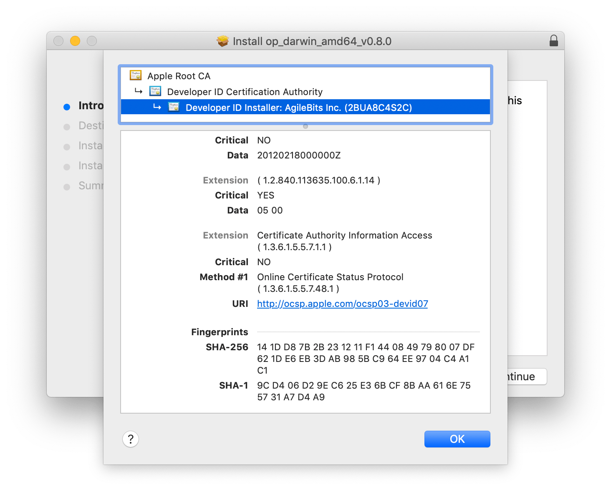
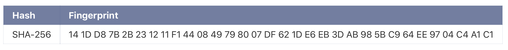

# Verifying .pkg files on a Mac (using Go)
#meta datetime 2020-08-22
#meta tags[] 1password security golang

## Summary

I have been looking at using [1Password's CLI tool](https://support.1password.com/command-line-getting-started/) to better manage secrets on the terminal.  1Password
[strongly recommends you verify your download](https://support.1password.com/verify-command-line/).



I decided to write a small [shapkgsum](https://github.com/aforward/shapkgsum) script in [golang](https://golang.org) to make that verification easier to automate. 

## Article

I have been looking at using [1Password's CLI tool](https://support.1password.com/command-line-getting-started/) to better manage secrets on the terminal.  1Password
[strongly recommends you verify your download](https://support.1password.com/verify-command-line/).


And that should be compared again the posted fingerprint



The installer does mention that `the installer automatically verifies the files in the package`, but I wanted to dive deeper into the process.

Let's say we have downloaded 1password to `/tmp/op_darwin_amd64_v1.5.0.pkg`, we can
view the package information by running

```bash
pkgutil --check-signature /tmp/op_darwin_amd64_v1.5.0.pkg
```

The output should look similar to

```bash
Package "op_darwin_amd64_v1.5.0.pkg":
   Status: signed by a developer certificate issued by Apple for distribution
   Signed with a trusted timestamp on: 2020-08-18 15:47:29 +0000
   Certificate Chain:
    1. Developer ID Installer: AgileBits Inc. (2BUA8C4S2C)
       Expires: 2024-10-23 17:10:43 +0000
       SHA256 Fingerprint:
           14 1D D8 7B 2B 23 12 11 F1 44 08 49 79 80 07 DF 62 1D E6 EB 3D AB
           98 5B C9 64 EE 97 04 C4 A1 C1
       ------------------------------------------------------------------------
    2. Developer ID Certification Authority
       Expires: 2027-02-01 22:12:15 +0000
       SHA256 Fingerprint:
           7A FC 9D 01 A6 2F 03 A2 DE 96 37 93 6D 4A FE 68 09 0D 2D E1 8D 03
           F2 9C 88 CF B0 B1 BA 63 58 7F
       ------------------------------------------------------------------------
    3. Apple Root CA
       Expires: 2035-02-09 21:40:36 +0000
       SHA256 Fingerprint:
           B0 B1 73 0E CB C7 FF 45 05 14 2C 49 F1 29 5E 6E DA 6B CA ED 7E 2C
           68 C5 BE 91 B5 A1 10 01 F0 24
```

You will notice the `14 1D D8 ...` that aligns with the 1Password posted fingerprint.
But let's write a small script to do this for us ([shapgksum source code here](https://github.com/aforward/shapkgsum))

Here is the [golang](https://golang.org) source (very primitively) tease out the SHA256 fingerprint from above.

```go
package main

import (
  "log"
  "os"
  "os/exec"
  "regexp"
  "strings"
)

type fingerprint string

func pkgutil(filename string) string {
  out, err := exec.Command("pkgutil", "--check-signature", filename).Output()
  if err != nil {
    log.Fatal(err)
    os.Exit(1)
  }
  return string(out[:])
}

func newFingerprintFromPkgutil(filename string) fingerprint {
  output := pkgutil(filename)
  return newFingerprintOutput(output)
}

func newFingerprintOutput(output string) fingerprint {
  isFound := false
  fingerprints := []string{}
  for _, v := range strings.Split(output, "\n") {
    firstMatch, _ := regexp.MatchString(`SHA256`, v)
    lastMatch, _ := regexp.MatchString(`-------`, v)

    if lastMatch {
      return fingerprint(strings.Join(fingerprints, " "))
    } else if isFound {
      fingerprints = append(fingerprints, strings.TrimSpace(v))
    } else if firstMatch {
      isFound = true
    }
  }

  return ""
}
```

The command line tool (`shapkgsum`) then looks like

```go
package main

import (
  "fmt"
  "os"
)

func main() {
  filename := os.Args[1]
  fingerprint := newFingerprintFromPkgutil(filename)
  fmt.Println(fingerprint)
}
```

You can run the code yourself, as shown here.

```bash
wget https://github.com/aforward/shapkgsum/raw/main/bin/shapkgsum && \
chmod 755 ./shapkgsum
./shapkgsum /tmp/op_darwin_amd64_v1.5.0.pkg
```

And now only the first fingerprint is return, for example

```bash
14 1D D8 7B ...
```

You can now more easily compare the package before installing

```bash
# information on verifying the signature is available
# https://support.1password.com/verify-command-line/
AGILEBITS=$(./shapkgsum op_darwin_amd64_v1.5.0.pkg)
FINGERPRINT="14 1D D8 7B ..."
if [ "${AGILEBITS}" != "${FINGERPRINT}" ]; then
  echo "Unverified signature"
  echo "${AGILEBITS}"
  exit 1
else
  echo "Signature verified"
fi
```

I am (extremely) confident that I have downloaded the correct 1Password CLI.  I am (euqally extremely) new to [golang](https://golang.org) and still getting my bearing with respect to writing pragmatic go.  Resources and feedback welcome.
