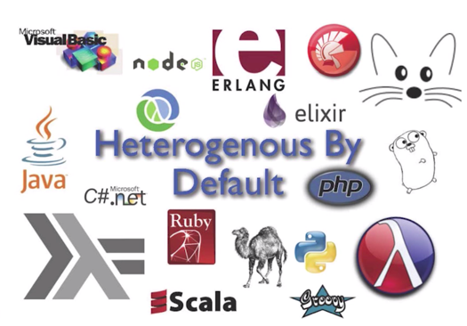

# The Code I Didn’t Write
#meta datetime 2019-07-06
#meta tags[] software

## Summary

I enjoy reading job listings.  There's the "what's trending"
angle to see the types of skills that appear to be in bemand.
There's the pyschological angle where we as the reader
get a peak at what a company values (or doesn't value) when
it comes to hiring and employees.

## Article

I enjoy reading job listings. You can learn a lot about

+ **What's trending** from employers
+ How employers **conduct** their screening process
+ **Where** the jobs are located
+ The current **trend about remote** workers
+ The **value** that the company places on their hiring practices

In this article, I will focus on one question that I have
seen popup in a few times and it goes something like this...

## Show us some of your code, and talk about it

<a href="https://xkcd.com/664/">XKCD Cartoon</a>

What a fascinating question.

There are so many layers to an answer, but you also must bear in mind the target audience.  In particular

+ This is geared towards your new employer
+ They probably have zero context
+ What angle are you going for (more on that below)
+ Are you _allowed_ to share the code in question

You are writing this as part of your _best self_, this is not being untrue to yourself anymore than it's untrue to wear a suit to an interview even though you might not wear them everyday.

<a href="https://www.imdb.com/title/tt2235831/mediaviewer/rm3052254720">Image From IMDB</a>

You must be careful with proprietary closed source examples.  Avoid that code if you can, or if you must please ensure that it sufficiently obfuscated.

You must also communicate to your audience that probably has zero context about the code, they might not even be that familiar with the programming language about why it is so ...

+ Great,
+ Or clever,
+ Or performant,
+ Or most actively maintained,
+ Or most liked,
+ Or because it is super stable,
+ Or boring but works great,
+ Or maybe has a some historical significance

It is also an intimidating question... you have to pick just _one_ piece of code and what’s beautiful to some might be utter rubbish to others.  Maybe someone thinks your code is too clever (and it shouldn't be), or maybe your code is too simple (and does not consider enough edge cases), or maybe you used a `foreach` loop and everyone knows (tongue in cheek) that a `map` is always better.

I see three general approaches to answering this question

#### Isolated Code

Code that did some task, but is isolated enough that you could explain why it's awesome to almost anyone.  This would be the most straight forward answer.  Maybe you implemented an algorithm, or wrote some interesting query, or connected to an API, or solved a programming challenge.

#### Symbolic Code

Code that is more symbolic and has a great story behind it (so its more the nostalgia of the code versus the code itself).  Maybe it was the first code you wrote as a paid software developer, or in a language you learned on your own, or the first commit in a project that blossomed into something great.

#### Humble Code

Code that elicits a negative reaction and acts as a reminder of the terrible, or obtuse, or complicated, or even clever code that you had written in the past and now have to live with that decision. Sometimes we learn better from our mistakes, and helps us to stay humble in a profession that sometimes runs on caffeine and egos.

### Write for the audience, not the author

Context matters.  Tabs or Spaces; it depends.  Ruby or Java; it depends.  Rebase or merge; it depends.

Regardless how pure you want your answer to be, in this context it is being asked as a means to evaluate your job application.  We are trying to demonstrate how **great** a candidate you are, or at the least to make enough of an impression to make it to the next step in the process.

In one (of many) great talks from [Chad Fowler](http://chadfowler.com/), we get some insight into the [dangers of stability and homeostatis](https://www.youtube.com/watch?v=sAsRtZEGMMQ).  The system _should_ be heterogenous by default and getting into the habit of throwing code away.

Contrast that with an tweet from from [David Heinemeier Hansson](https://dhh.dk/) at Basecamp.

<blockquote class="twitter-tweet" data-lang="en">
Fun fact: The <a href="https://twitter.com/basecamp?ref_src=twsrc%5Etfw">@basecamp</a> billing script that runs once a day was written by <a href="https://twitter.com/jamis?ref_src=twsrc%5Etfw">@jamis</a> more than a decade ago, and has barely been touched since. 135 lines of Ruby that&#39;s responsible for collecting hundreds of millions of dollars in revenues 🤑
&mdash; DHH (@dhh) <a href="https://twitter.com/dhh/status/1098007632852336640?ref_src=twsrc%5Etfw">February 19, 2019</a></blockquote>

So, the same piece of code `you think is awesome` could be seen as great when shone in one light, and abismal in the other.

Don't overly tailor your answer, but indeed consider looking into your audience to see what they value and then try to find code that will resonate with them.

### How would I answer that question?

It depends.

In this article I wanted to explore an answer that, unless you are [Bob Newhard waking from a dream sequence](https://youtu.be/ZgdUWXf8jJk), is somewhat of a cop-out answer.

But here goes nonetheless.

### I am most proud of the code I did not write

Much like the feeling of pride when you get to delete code,
there is equal enjoyment when you can avoid writing code in the first place.  Maybe you were able to solve the problem in a _simpler_ way, or you were able to avoid doing _what every does in similar situations_ because it was not needed in this particular case.

In the abstract, this is a bit too motherly to provide much help to anyone.  So let’s instead look at a few examples to illustrate my thinking about _not_ writing code.

#### Flat Files Over A Database

Heaven forbid, but yes I recently (2015) wrote an API that stored data in flat files.

I stored the data in JSON and despite some initial technical push-back, I was afforded the leeway to pursue this design, and it worked out extremely well. Here are a few things that I helped give me confidence this was the right approach.

* Unclear operations environment.  The consumer of the API (a wordpress site) and the overall deployment architecture was a bit in flux including which technologies would be available, and who would be responsible for caching them.

* HTTP Level Caching.  The API was delivered over HTTP, and so we could leverage caching using HTTP headers in the I/O from reading the flat files became a bottleneck.

* Unclear solution.  Using [tracer bullets]() we built the system knowing that what we delivered and how it would be used remained in flux.  This makes NoSQL (or NewSQL) and JSON a great choice for a more fluid data schema.

And 4 years later, the flat files are still running strong. As a small confession, part of my concession when getting approval to push flat files was that I would eventually write a MySQL storage adapter.  And I did write it. But, it was never deployed. The flat-file implementation was not only simpler to deploy but also simpler to back-up and version control.

So despite the fact that I actually _did_ write the MySQL adapter, as it was never officially used, I consider it among my examples of **code I didn’t have to write**.

#### Zero Caching

I wrote a mortgage calculator API for a new mortgage broker ([Hatch Mortgage](https://hatchmortgage.com/)) that wanted to make things like _affordability_ and _payouts schedules_ much easier for people to navigate and understand.  This company was more interested in helping it's client answer questions from their perspective:

* I make this this much, how much house can I afford
* I want this big a house, how much downpayment do I need

The API was 100% functional in that the code took all necessary inputs and re-cacluated everything from scratch each time.  No caching, no look-up tables, just a few _calculus_ calls and lots of data returned the client.

Why so proud of a few _math_ functions?

Well, Hatch Mortgage switched IT companies mid project (due to reasons outside of my control).  As a sub-contractor on this project, I delivered on the API but was not involved in the overall design and implementation of website.

The front end was re-written using Wordpress, but that little Mortgage API remained, unchanged and proved to be fast enough for their needs, and continues to be used to this day (2019).

I focussed first on being _right_, and then on being _pretty_, and it turns out we didn’t need to _make it fast_ (as it was already fast enough for the use case).  Indeed some of the API payloads are large coming in at 100kb of data, but that pales in comparison to say a poorly compressed 4mb JPEG image.

#### Let Your Email Provider Do The Filtering

For context, this particular client of mine _loves_ email and as a developer I can appreciate its simplicity so tacking on a product like HelpScout or ZenDesk would not (and in other similar scenarios in fact **did not**) work.

When working on a payment gateway for a client, there was a request to have any failed payments route to an additional email address in addition to one already being CCed on all payment notifications.

Instead of _complying directly_ with the ask and updating our reconciliation code when updates are received from our payment gateway, I pushed back and inquired a bit more about why this was wanted.

Turns out that the underlying need could be more easily accomplished with an _email group_ and using _email filters_ to accomplish the desired goal.  So instead of implementing custom one-off _filters_ within our code base, we pushed that into our email server which had much better filter capabilities.

In the end we were able to give the client even more customized filters than they had originally thought possible; and the only coding change was a small **config** to the newly configured email group.

#### Re-Using IDs

Last example.

Here, the client was moving from a custom invoicing and payment system to integrate with an _enterprise_ accounting system.  The payment system was staying in place, just the invoicing software was being replaced.

Instead of integrating that accounting system directly with the payment gateway, we instead wrote a small adapter to make those accounting invoices look and behave like the  custom invoices.

That tiny adapter (let’s say 100 lines of code or so) meant that our automatic billing solution remained unchanged, our custom checkout webapp also unchanged and our reconciliation service (to double check that all payments from our gateway were properly handled) also remained unchanged.

Our solution ended up providing a second benefit.  Turns out that the accounting software had some shall we say _performance bottlenecks_ when serving up invoice data.  As invoices are write-once, we enabled _caching_ by changing the _fetch_ of the invoice data to only be done the first time, which took only a few lines of extra code.

### Be proud of the code you don’t write.

Although the examples above did involve _some_ code, the underlying spirit of implementing the feature focussed on using what was already available.

