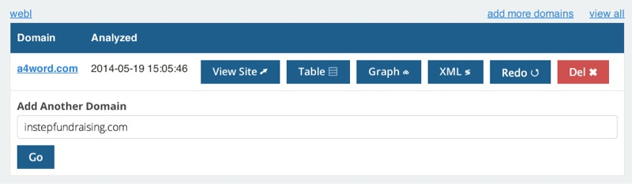
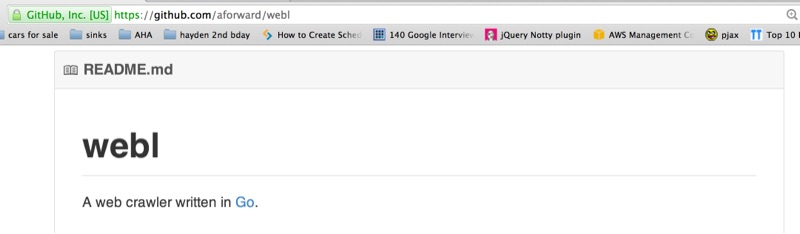
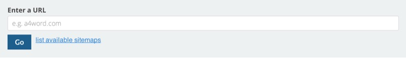
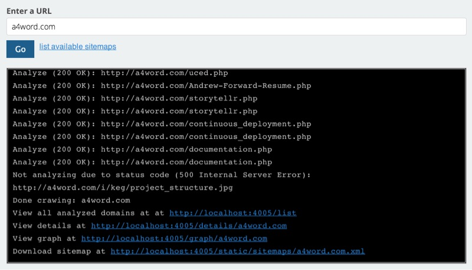
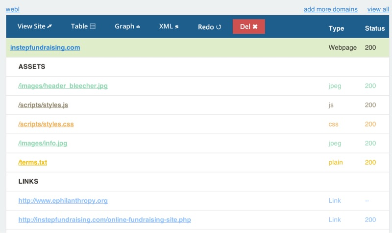
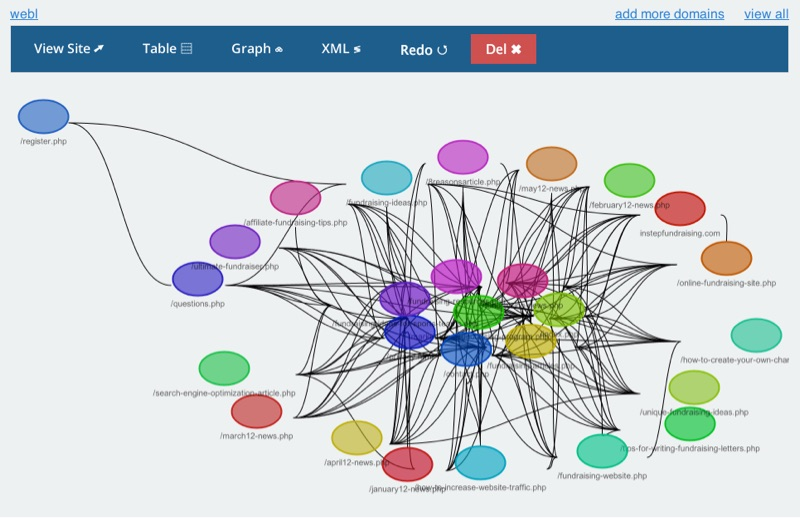
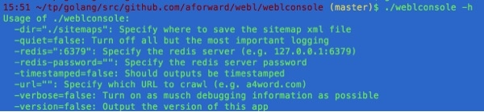
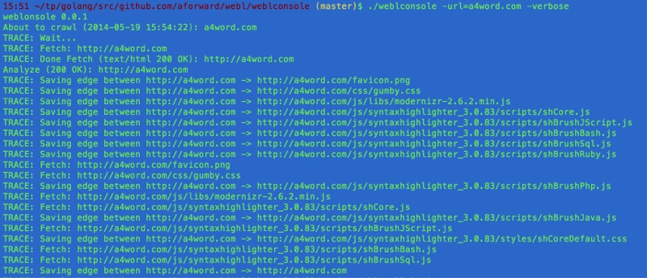
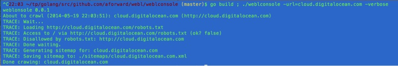

# A simple web crawler in Golang
#meta tags[] golang experiment
#meta datetime 2014-06-07

## Summary

An exploration of the Go language (golang) to build a simple webcrawler, all code is available on [Github](https://github.com/aforward/webl). This application was written as an exploration of the language and demonstration of the various features of the language; it is not feature complete but should be complex enough to provide some examples of using Go's various concurrent features, tied together in a simple command line and web interface.



## Article

An exploration of the Go language (golang) to build a simple webcrawler, all code is available on [GitHub](https://github.com/aforward/webl).  This application was written as an exploration of the language and demonstration of the various features of the language; it is not feature complete but should be complex enough to provide some examples of using Go's various concurrent features, tied together in a simple command line and web interface.



### Installation

The webcrawler uses [Redis](https://redis.io), to store results. Please install it and ensure it is running before starting.</p>

Grab the three projects:

```shell
go get github.com/aforward/webl/api
go get github.com/aforward/webl/weblconsole
go get github.com/aforward/webl/weblui
```

Build and test them

```shell
cd $GOPATH/src
go test github.com/aforward/webl/api
go build github.com/aforward/webl/weblconsole
go build github.com/aforward/webl/webluiß
```

### The Web Application

To start the webserver

```shell
cd $GOPATH/src/github.com/aforward/webl/weblui
go build
./weblui
```

The launched application should be available at [http://127.0.0.1:4005](http://127.0.0.1:4005), and you can add urls to crawl.



Using websockets, it attaches itself to the running project and streams the current status back to Javascript.



Data is persisted to [Redis](https://redis.io), so that you can view recently crawled


In the details view, we show the sitemap as a table, showing links (to other pages), and assets (being used on the current page, e.g. Javascript / CSS). For simplicity, we are only crawling within a domain (e.g. a4word.com), and do not look beyond (e.g. twitter.com / facebook.com) or within other subdomains (e.g. admin.a4word.com).



I experimented with [Graph Dracula](http://www.graphdracula.net/) for some better visualizations, but right now the results are far too busy.



### The Console Application

To start the console

```shell
cd $GOPATH/src/github.com/aforward/webl/weblconsole
go build
# change a4word.com with your url
./weblconsole -url=a4word.com
```

The webl library is consumed by a web application (described above) and console application, described here.  Both systems are thin clients and push most of the work to the Go library.



In fact, the logged output in the web application is drawn from the same logging information used to display to the console (but the console has extra flags to turn verbosity up and down)



### The Data Store

For simplicity, data is stored in a [Redis](https://redis.io) database.  We are using a set to manage all crawled domains.

```shell
127.0.0.1:6379> smembers domains
1) "instepfundraising.com"
2) "a4word.com"
```

Each resource is unique identified by it's [URL:](http://en.wikipedia.org/wiki/Uniform_resource_locator) and is stored internally as a has of properties

```shell
127.0.0.1:6379> hgetall "resources:::http://a4word.com/snippets.php"
 1) "name"
 2) "/snippets.php"
 3) "lastanalyzed"
 4) "2014-05-19 15:54:23"
 5) "url"
 6) "http://a4word.com/snippets.php"
 7) "status"
 8) "200 OK"
 9) "statuscode"
10) "200"
11) "lastmodified"
12) ""
13) "type"
14) "text/html"
```

Assets and Links within a page are stored in an _edges_ set for each resource.

```shell
127.0.0.1:6379> smembers "edges:::http://a4word.com/snippets.php"
 1) "http://a4word.com/Andrew-Forward-Resume.php"
 2) "http://a4word.com/css/gumby.css"
 3) "http://a4word.com/snippets.php"
 4) "http://a4word.com/js/syntaxhighlighter_3.0.83/scripts/shBrushBash.js"
 5) "http://a4word.com/js/libs/ui/gumby.retina.js"
 6) "http://a4word.com"
```

The data structure in Go represent the results of a crawl, are captured in a Resource struct.

```go
type Resource struct {
  Name string
  LastAnalyzed string
  Url string
  Status string
  StatusCode int
  LastModified string
  Type string
  Links []*Resource
  Assets []*Resource
}
```

### Configure The Logger

To flexibly manage the logging of information, we configured four type of logs:

```go
// TRACE: For a more in-depth view of how the code is behaving</li>
// INFO: Key feedback of the running system</li>
// WARN: When things go awry, but not necessary totally un-expected</li>
// ERROR: Catatrosphic issue that typically results in a shut down of the app</li>
```

From the command line, by default, we display INFO, WARN, and ERROR.  Using the `-verbose` flag, we include TRACE, and using the `-quiet` flag we turn off INFO (and TRACE is off too).  This is accomplished by setting the appropriate io.Writer.

```go
// use ioutil.Discard to ignore message
// use os.Stdout for displaying messages to the standard console
// use os.Stderr for displaying messages to the error console
```

In addition, the logger also accecpt a WebSocket (\*websocket.Conn), which allows us to stream results from the crawler directly to the browser.

### Using WaitGroups For Concurrency

The Crawl algorithm is broken down into two parts: fetch and analyze.  The fetch portion performs an HTTP Get on the domain being crawled, and then passes the response to the analyze to extract the wanted metadata (like status code, and document type) as well as look for additional links to fetch.

```go
// A trimmed down version of Crawl to show the basic of WaitGroups
func Crawl(domainName string) {
  var wg sync.WaitGroup
  wg.Add(1)

  alreadyProcessed := set.New()
  url := toUrl(domainName,"")
  name := ToFriendlyName(url)

  AddDomain(&Resource{ Name: name, Url: url, LastAnalyzed: lastAnalyzed })
  go fetchResource(name, url, alreadyProcessed, &wg)
  wg.Wait();
}
```

In the crawl, we setup a synchronized set to avoid processing the same link twice, and delegate the fetching of the data to a goroutine fetchResource.  To ensure the main program doesn't quit right away, we use a WaitGroup to track how many things we have left to process.

In a first, iteration, the fetchResource needs to tell the WaitGroup, it's done, and we do this with a defer call (similar to ensure in ruby).

```go
func fetchResource(domainName string, currentUrl string, alreadyProcessed *set.Set, wg *sync.WaitGroup) {

  // When the method ends, decrement to wait group
  defer wg.Done()

  // Don't re-process the same urls
  if alreadyProcessed.Has(currentUrl) {

  // Only process the Urls within the same domain
  // (a rule for this web crawler, not necessarily yours)
  } else if shouldProcessUrl(domainName,currentUrl) {
    alreadyProcessed.Add(currentUrl)

    // Fetch the data
    resp, err := http.Get(currentUrl)
    should_close_resp := true

    if err != nil {
      return
    } else {
      contentType := resp.Header.Get("Content-Type")
      lastModified := resp.Header.Get("Last-Modified")

      // Only webpages (e.g. text/html) should be trasversed
      // other links are assets like JS, CSS, etc
      if IsWebpage(contentType) {
        if resp.StatusCode == 200 {
          should_close_resp = false

          // More work to do, so increment the WaitGroup
          // And delegate to the analyzer
          wg.Add(1);
          go analyzeResource(domainName, currentUrl, resp, alreadyProcessed, httpLimitChannel, wg)
        }
      }
    }

    // Note that the analyzeResource will close
    // the response, but it's not called in all cases
    // So I have this extra code here
    if should_close_resp {
      if resp == nil || resp.Body == nil {
        return
      }
      defer io.Copy(ioutil.Discard, resp.Body)
      defer resp.Body.Close()
    }
  }
}
```

The analyzer will process the data, identify the links and then fetch them.

```go
func analyzeResource(domainName string, currentUrl string, resp *http.Response, alreadyProcessed *set.Set, httpLimitChannel chan int, wg *sync.WaitGroup) {
  defer wg.Done()
  defer resp.Body.Close()
  defer io.Copy(ioutil.Discard, resp.Body)

  tokenizer := html.NewTokenizer(resp.Body)
  for {
    token_type := tokenizer.Next()
    if token_type == html.ErrorToken {
      // Something went wrong in the processing of the file
      if tokenizer.Err() != io.EOF {
        WARN.Println(fmt.Sprintf("HTML error found in %s due to ", currentUrl, tokenizer.Err()))
      }
      return
    }
    token := tokenizer.Token()
    switch token_type {
    case html.StartTagToken, html.SelfClosingTagToken:

      path := resourcePath(token)

      // If the found token contains a link to another URL
      // Then we have more work to, and must fetch another resource
      if path != "" {
        wg.Add(1)
        nextUrl := toUrl(domainName,path)
        go fetchResource(domainName,nextUrl,alreadyProcessed,httpLimitChannel,wg)
      }
    }
  }
}
```

For simplicity, I stripped out the persistence of the crawled data, so please refer to the [GitHub project](https://github.com/aforward/webl) to browse the working code.

### Throttle http.Get with a Channel (semaphore)

Go is fast, fast enough that you can run out of resources locally (i.e. 1024 open files), or burden the remote server.  To throttle goroutines, we use a "full" channel to limit the number of executing http.Get [Implementing a Semaphores in Go](http://www.golangpatterns.info/concurrency/semaphores).

```go
// fills up a channel of integers to capacity
func initCapacity(maxOutstanding int) (sem chan int) {
  sem = make(chan int, maxOutstanding)
  for i := 0; i < maxOutstanding; i++ {
    sem <- 1
  }
  return
}

// initialize the http GET limit channel
httpLimitChannel := initCapacity(4)

// wrap the http.GET around the channel
// as <- will block until available
<-httpLimitChannel
resp, err := http.Get(currentUrl)
httpLimitChannel <- 1
```

Here's a great talk [introducing Go's concurrency patterns](https://youtube.com/watch?v=f6kdp27TYZs)

### Respecting Robots.txt

The [Web Robots Pages](http://www.robotstxt.org/) describes how bots, like webl all allowed to interact with the site.  To achieve this, we used a [robotstxt](https://github.com/temoto/robotstxt-go) and enhanced the fetchResource to keep track of <i>which</i> robots it had loaded to avoid having to fetch the data on each request.



The bulk of the heavy lifting looks like the following:

```go
func canRobotsAccess(input string, allRobots map[string]*robotstxt.RobotsData) (canAccess bool) {
  canAccess = true
  robotsUrl := toRobotsUrl(input)
  inputPath := toPath(input)

  if robot,ok := allRobots[robotsUrl]; ok {
    if robot == nil {
      return
    }
    canAccess = robot.TestAgent(inputPath, "WeblBot")
  } else {
    allRobots[robotsUrl] = nil
    TRACE.Println(fmt.Sprintf("Loading %s",robotsUrl))
    resp, err := http.Get(robotsUrl)
    if resp != nil && resp.Body != nil {
      defer resp.Body.Close()
    }
    if err != nil {
      return
    }
    if resp.StatusCode != 200 {
      TRACE.Println(fmt.Sprintf("Unable to access %s, assuming full access.",robotsUrl))
      return
    } else {
      robot, err := robotstxt.FromResponse(resp)
      if err != nil {
        return
      }
      allRobots[robotsUrl] = robot
      canAccess = robot.TestAgent(inputPath, "WeblBot")
      TRACE.Println(fmt.Sprintf("Access to %s via %s (ok? %t)",inputPath,robotsUrl,canAccess))
    }
  }
  return
}
```

### If you wanted to improve things

+ Adding the ability to manage multiple crawls over a domain and provide a diff of the results.
+ Adding security to prevent abuse from crawling too often.
+ Improve visualization based on how best to use the data (e.g. broken links, unused assets, etc).  This will most likely involve an improved data store (like Postgres) to allow for reaching searching.
+ Improved sitemap.xml generation to grab other fields like priority, last modified, etc.
+ Improved resource meta-data like title, and keywords, as well as taking thumbnails of the webpage.
+ Improved link identification by analyzing JS and CSS for urls.
