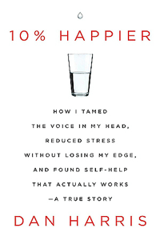

# 10% Happier: How I Tamed the Voice in My Head, Reduced Stress Without Losing My Edge, and Found Self-Help That Actually Works - A True Story
## Dan Harris
#meta published 2019-04-16
#meta datetime 2021-01-01

The book starts as a life story of journalist covering the typical topics of sex, drugs and public life.

Harris eventually gets into his discovery of mindfulness and meditation.