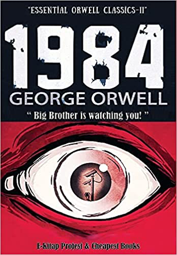

# 1984
## George Orwell
#meta published June 8, 1949
#meta tags[] read 2021
#meta datetime 1949-06-08

Finally read the book.

Winston is a rank-and-file worker who secretly hates the Party and dreams of rebellion.

Felt like the Matrix's circular illusion of control.  Thoroughly enjoyed it.