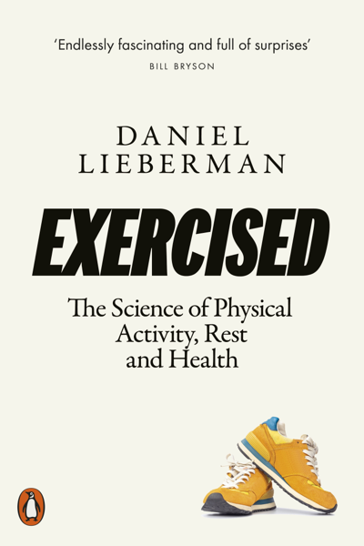

# Exercised
## Daniel Lieberman
#meta published 2021-01-05
#meta datetime 2022-11-01

If exercise is healthy (so good for you!), why do many people dislike or avoid it?
These engaging stories and explanations will revolutionize the way you
think about exercising—not to mention sitting, sleeping, sprinting,
weight lifting, playing, fighting, walking, jogging, and even dancing.
