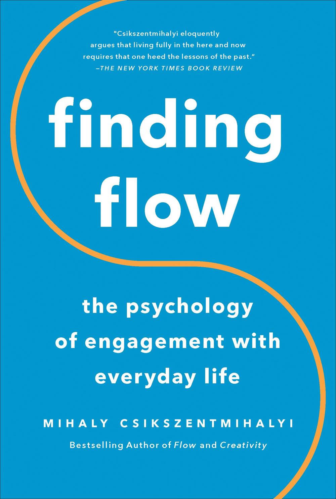

# Finding Flow: The Psychology of Engagement with Everyday Life
## Mihaly Csikszentmihalyi
#meta published Apr 6, 1998
#meta tags[] basecamp unread
#meta datetime 1998-04-06

From [Basecamp's handbook on what influenced them](https://basecamp.com/handbook/03-what-influenced-us). True happiness is found in optimal moments of engagement when we stretch just beyond our abilities and lose track of time and space in the process. Protecting the flow by limiting interruptions has been a driving principle of Basecamp.