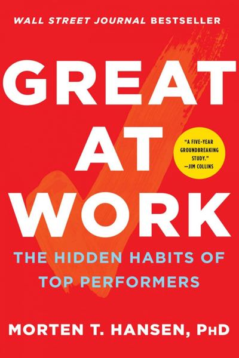

# Great at Work
## Thomas Erikson
#meta published 2018-01-30
#meta datetime 2022-06-01

Why do some people perform better at work than others? This deceptively simple question
continues to confound professionals in all sectors of the workforce. Now,
after a unique, five-year study of more than 5,000 managers and employees,
Morten Hansen reveals the answers in his "Seven Work Smarter Practices" that can
be applied by anyone looking to maximize their time and performance.
