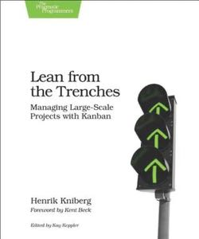

# Lean From the Trenches: Managing Large Scale Projects with Kanban
## Henrik Kniberg
#meta published 2011-12-01
#meta datetime 2021-01-01

A book on a successful project delivery using Kanban.  The project was delivered over a two year timeframe, using Kanban at limit work in progress, Scrum for meetings and XP for software construction (paired programming, test automation).  The project was co-located with up to 60 team members at one time and was very low-tech (whiteboards and sticky notes).  Checkout [author blog](http://blog.crisp.se/author/henrikkniberg) or [book feedback on pragprog](http://pragprog.com/book/hklean/lean-from-the-trenches).

A few items of note

* Tech stories to help capture "clients don't care about this" work such as upgrading the database, or fixing the build server
* Multi-layered Kanban boards to split the overall project from individual teams.
* Continuous improvement through: Clarity, Communication, and Data
* Tracking velocity (# features per week, no story points!), and cycle time (weeks per feature)
* Sprint planning was about the-next-10-features based on business value, people available and feature dependencies