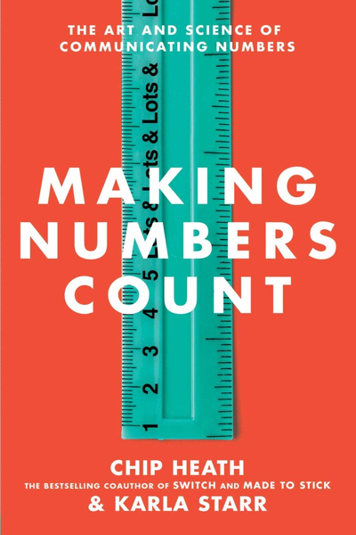

# Making Numbers Count
## Henrik Kniberg
#meta published 2022-01-11
#meta datetime 2022-07-01

How much bigger is a billion than a million?

Well, a million seconds is twelve days. A billion seconds is…thirty-two years.