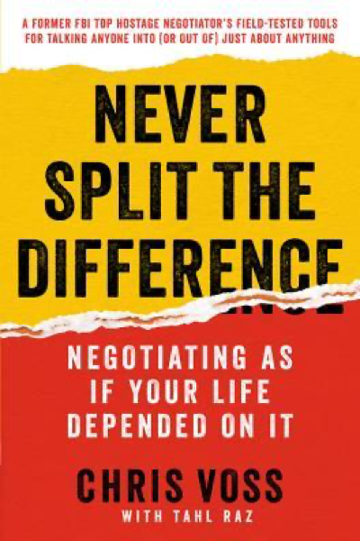

# Never Split the Difference: Negotiating As If Your Life Depended On It
## Chriss Voss
#meta published 2016-05-17
#meta datetime 2021-01-01

Get your opposition to work to solve your problems.  "How am I going to do that?".

Great stories, practical advice.

I found the title mis-leading as I thought it would be a more of a "winner takes all" approach, but really it's not (except maybe the story about buying his red truck).
