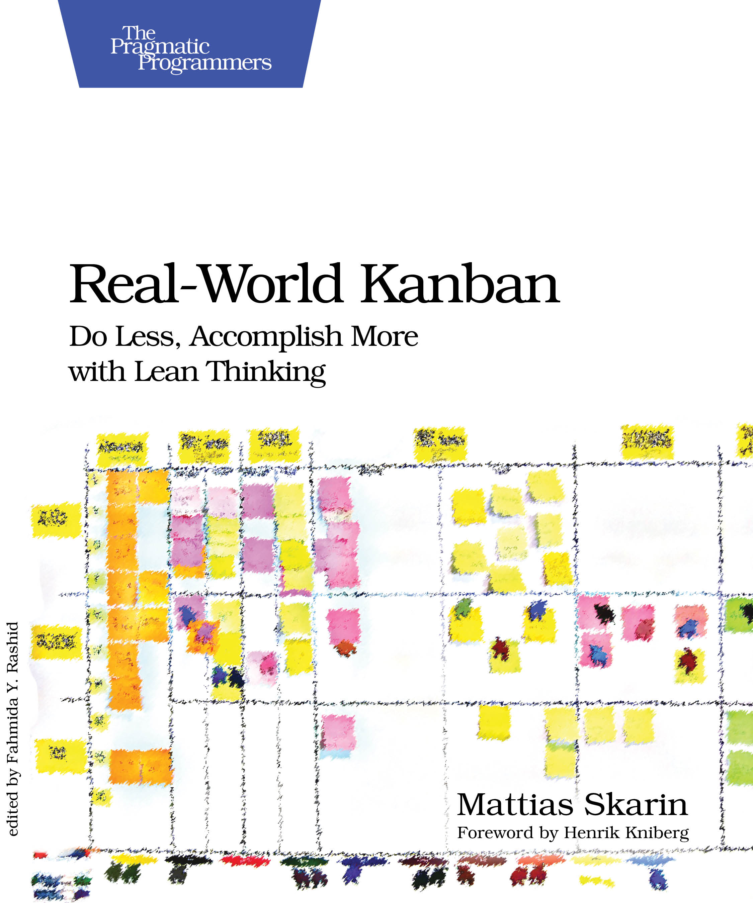

# Real-World Kanban: Do Less, Accomplish More with Lean Thinking
## Mattias Skarin
#meta published June 1, 2015
#meta tags[] pragprog pm read
#meta sort 2015-06-01

[Walks through 4 case studies on Kanban](https://pragprog.com/titles/mskanban/).  Kanban helps you see the current situation, but cannot help you decide what to do next; that is up to you!  To be lean you want to PDCA (Plan Do Check Act).  Focus on the flow, not sprints.
