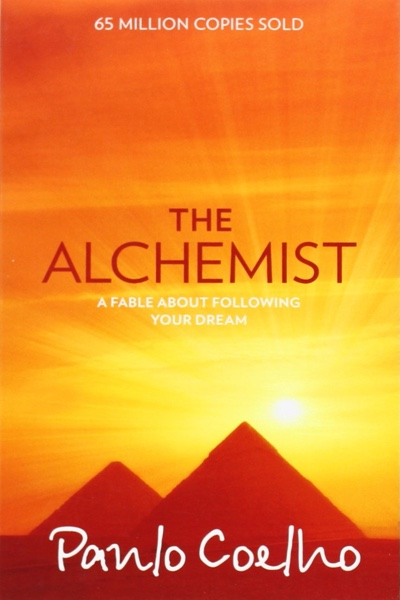

# The Alchemist
## Paulo Coelho
#meta published 1989-04-15
#meta datetime 2023-01-27

Paulo Coelho's masterpiece tells the magical story of Santiago,
an Andalusian shepherd boy who yearns to travel in search of a
worldly treasure as extravagant as any ever found.

The story of the treasures Santiago finds along the way teaches us,
as only a few stories can, about the essential wisdom of listening
to our hearts, learning to read the omens strewn along life's path,
and, above all, following our dreams.
