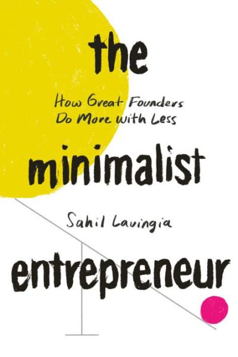

# The Minimalist Entrepreneur
## Sahil Lavingia
#meta published 2021-10-26
#meta datetime 2021-11-30

The Minimalist Entrepreneur teaches founders how to:

* start then learn
* build a community, then solve a problem for them
* charge for something even before you've built anything
* avoid running out of money and, more importantly, energy
* run a tight ship amid the rise of the gig economy and remote work
* own a business without it owning you back.