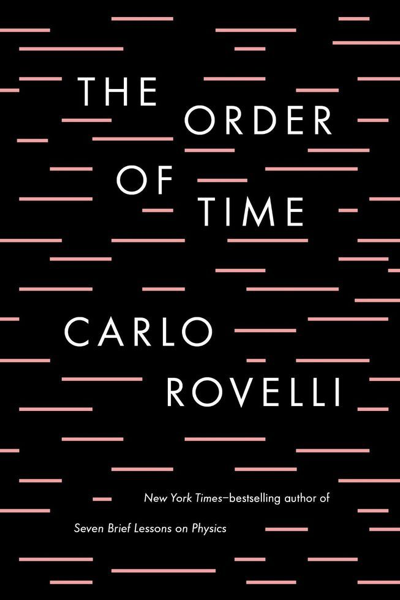

# The Order of Time
## Carlo Rovelli
#meta published 2018-05-08
#meta datetime 2022-11-01

Why do we remember the past and not the future? What does it mean for time to "flow"?
Do we exist in time or does time exist in us?

