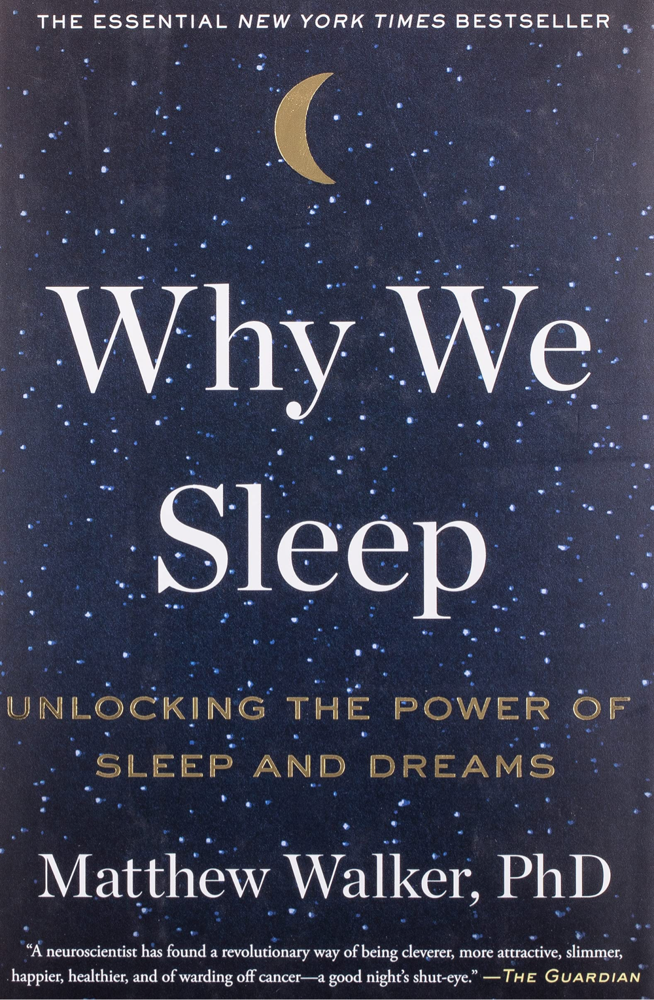

# Why We Sleep: Unlocking the Power of Sleep and Dreams
## Matthew Walker
#meta published October 1, 2017
#meta tags[] nonfiction read 2021
#meta sort 2017-10-01

"Make no mistake about it from a biochemical perspective, wakefulness is low level brain damage, and sleep is sanitary salvation."

An interesting look at the science of sleep, and the author provides some interesting perspectives that troubles sleeping might not be a symptom to accompany disease, but rather a (contributing) cause.

Maybe the question isn't why do we sleep, but rather why did we wake up?