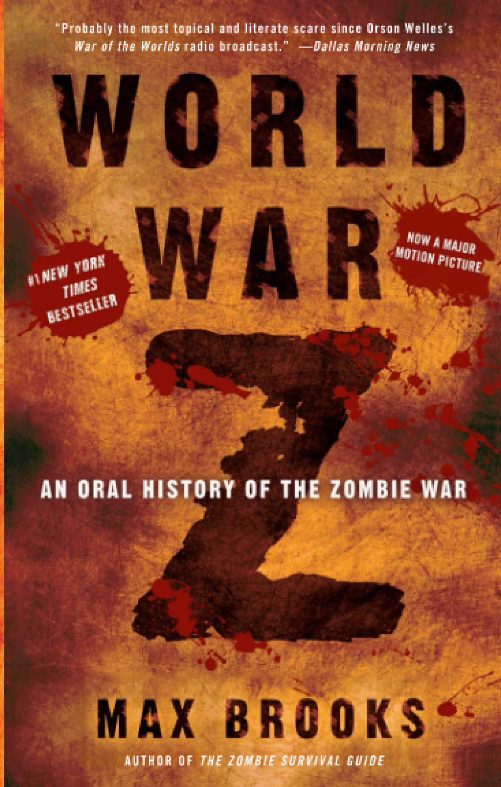

# World War Z: An Oral History of the Zombie War
## Max Brooks
#meta published October 16, 2007
#meta tags[] zombies fiction read 2021
#meta datetime 2007-10-16

A look back a the 10-year war against the Zombies.  The book
talks through the voices of those who lived the war.
