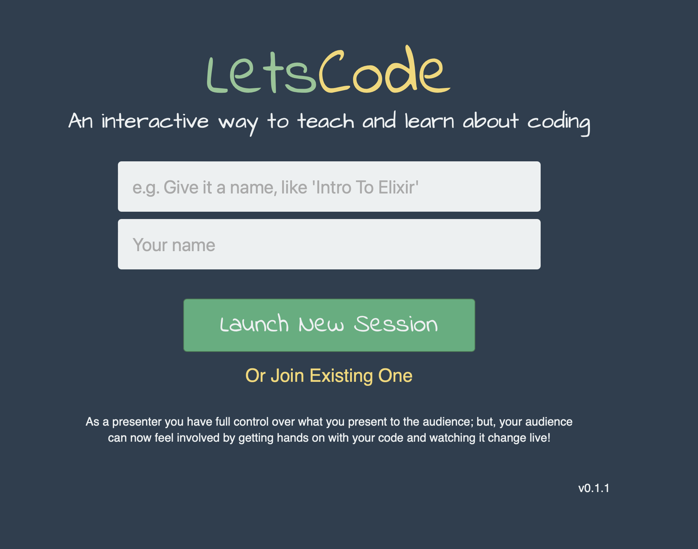
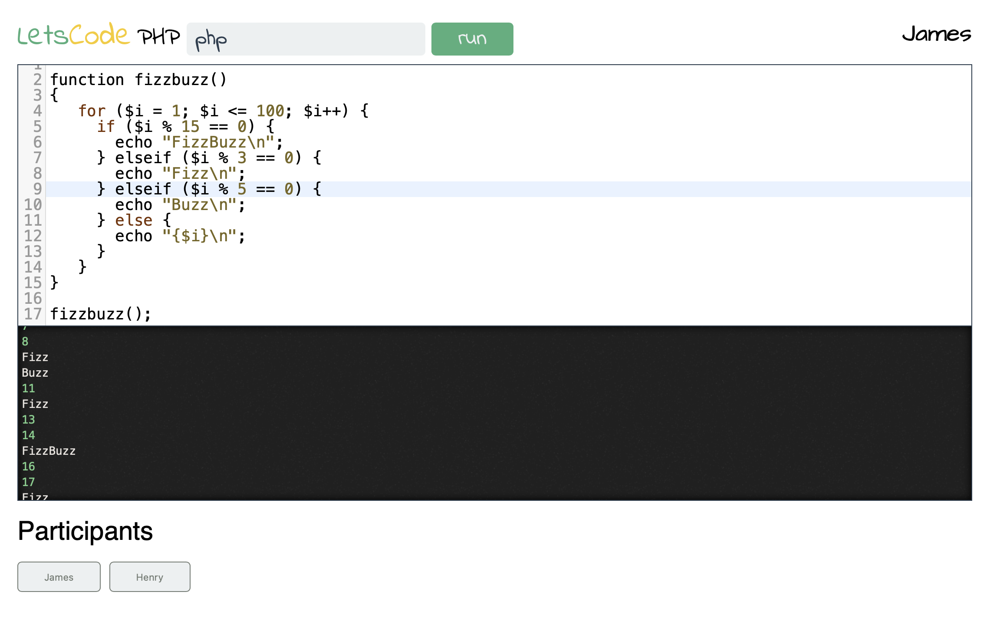
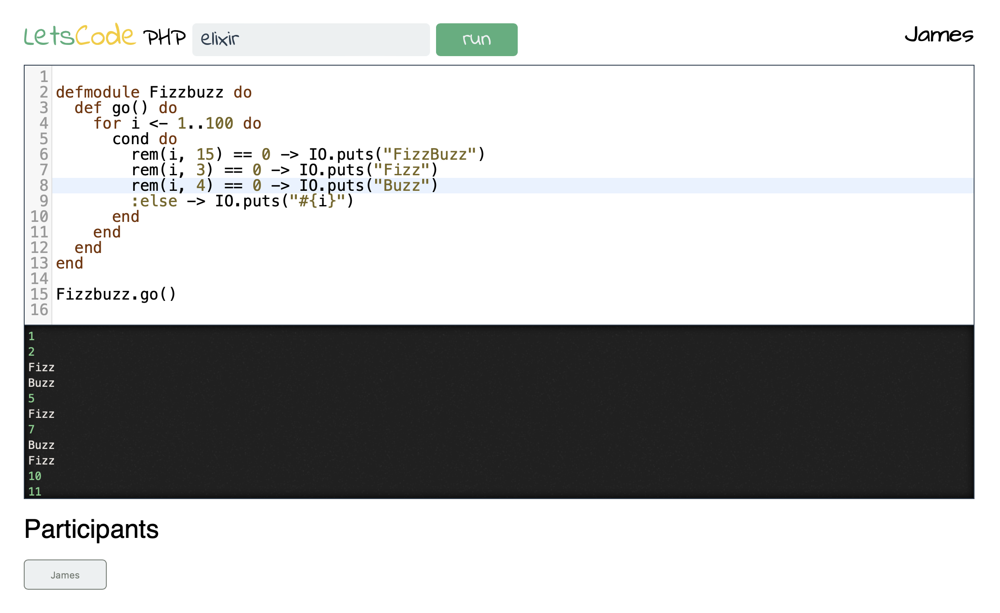

# LetsCode
## A shared editor to help teach programming languages

## Summary

An _experimental_ teaching aide for interacting with students while teaching lectures on programming languages.
The site is no longer live.

This tool gave students a playground to try ideas during the lecture to explore variations of examples presented during class and allowed the presenter to give students to control of the shared text editor so they could live demo their question “Hey, what about this snippet of code”.

## Images

