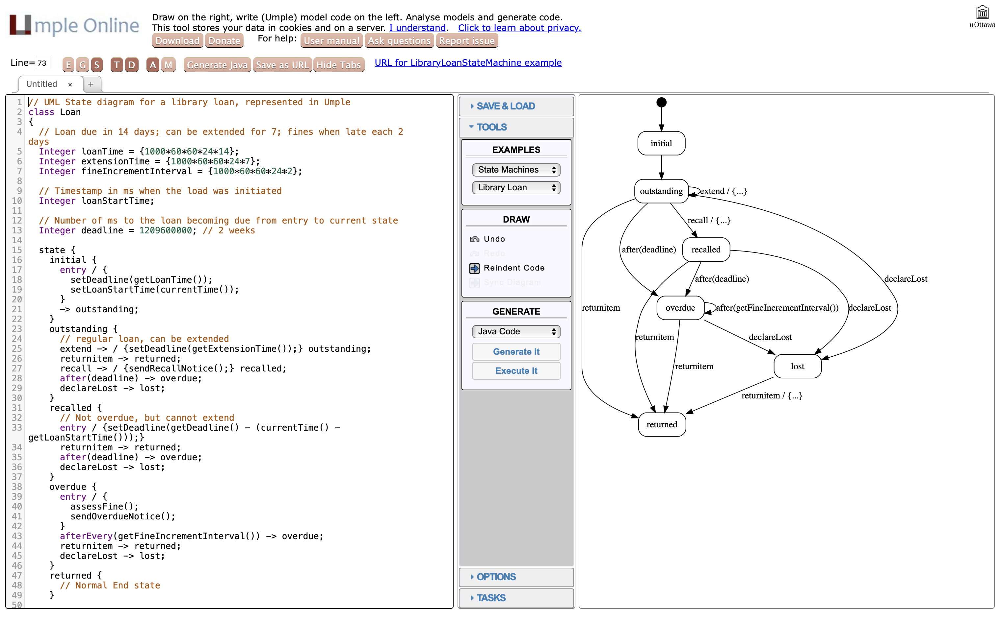
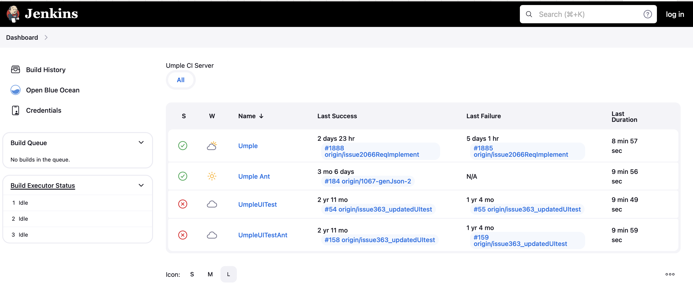
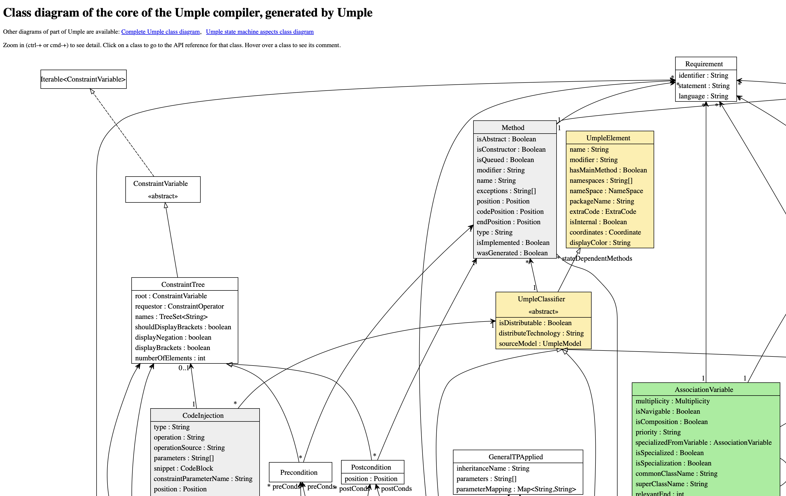
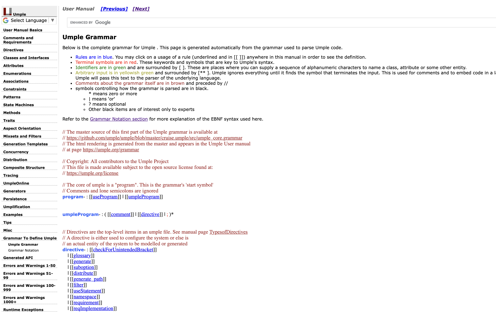

# Umple
## A model oriented programming language
#meta tech[] Java, Eclipse, IBM RSX, PHP, C++
#meta infra[] Jenkins, Ubuntu
#meta status active
#meta date 2010-09-21
#meta repos[] https://github.com/umple/umple

## Summary

A programming language (and suite of tools) that supports modeling concepts like associations and statemachines.

## Images

## Details

Built as part of my PhD (2006-2010), Umple continues to be used in academia
as an teaching aide allowing developers to embed modelling concepts (e.g. UML associations, state machines), patterns, generation templates, and other abstractions in traditional code, and vice versa. 

Our focus is two fold: high quality code AND enhancing (not replacing)
existing programming languages.

We strive to generate high quality code that *can be read and reasonabled about*, supporting Java, C++, PhP and Python.  Umple can also generate
several types of diagrams, generate metrics and generate other artifacts.

Umple can also be embedded directly in those programming languages without the
need to completely re-write your application.  It becomes an extension much
like using tools like Tailwind or Typescript where Umple compiles down alongside
your application into the native runtime language.
